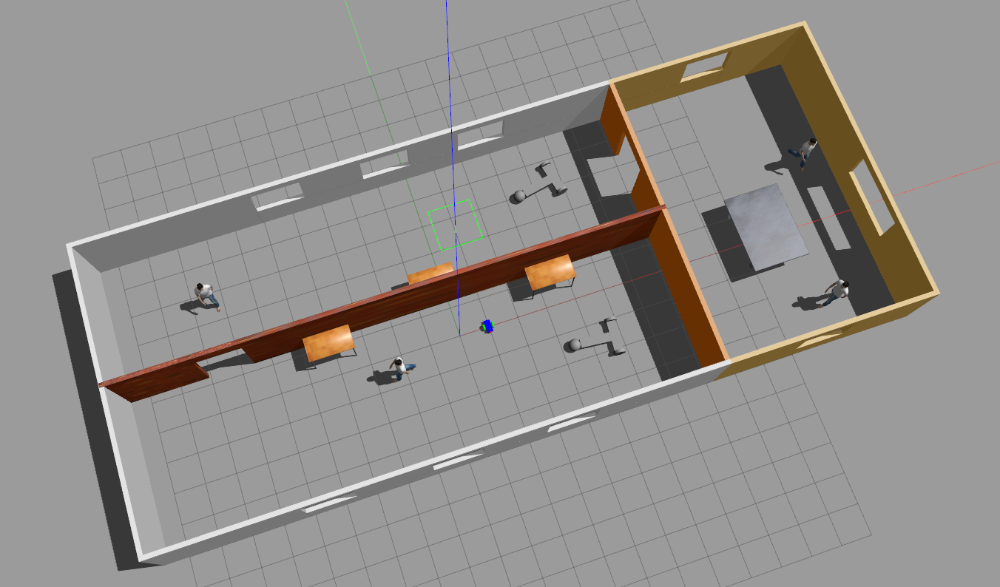

# ball_chaser

Build, source and launch the gazebo world:
```sh
cd ~/udacity_robotics_sw_engineer/3-ros_essentials/catkin_ws/src
catkin_make
source devel/setup.bash
roslaunch my_robot world.launch rviz:=false
```



## Drive bot

In a second terminal run the `drive_bot` node:
```sh
source ~/udacity_robotics_sw_engineer/3-ros_essentials/catkin_ws/devel/setup.bash
rosrun ball_chaser drive_bot
```

In a third terminal request a `ball_chaser/command_robot` service:
```sh
source ~/udacity_robotics_sw_engineer/3-ros_essentials/catkin_ws/devel/setup.bash
# Drive your robot forward
rosservice call /ball_chaser/command_robot "linear_x: 0.5
angular_z: 0.0"
# Drive your robot left
rosservice call /ball_chaser/command_robot "linear_x: 0.0
angular_z: 0.5"
# Drive your robot right
rosservice call /ball_chaser/command_robot "linear_x: 0.0
angular_z: -0.5"
# Bring your robot to a complete stop
rosservice call /ball_chaser/command_robot "linear_x: 0.0
angular_z: 0.0"
```

## Process_image
In a second terminal run the `drive_bot` and the `process_image` node:
```sh
source ~/udacity_robotics_sw_engineer/3-ros_essentials/catkin_ws/devel/setup.bash
roslaunch ball_chaser ball_chaser.launch
```

In a third terminal visualize the robot's camera images:
```sh
source ~/udacity_robotics_sw_engineer/3-ros_essentials/catkin_ws/devel/setup.bash
rosrun rqt_image_view rqt_image_view
```

Place the white ball at different positions in front of the robot and see if the robot is capable of chasing the ball!
