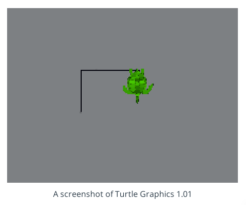

# ROS

## Table of contents
* [What is ROS?](#what-is-ROS)
* [ROS components and features](#ros-components-and-features)
* [ROS nodes and topics](#ros-nodes-and-topics)
  * [Quiz: Nodes and Topics](#quiz-nodes-and-topics)
* [ROS message](#ros-message)
  * [Quiz: Messages](#quiz-messages)
* [ROS services](#ros-services)
  * [Quiz: Services](#quiz-services)
* [Compute graph](#compute-graph)
* [ROS environment](#ros-environment)
  * [Quiz: Setting up the ROS environment](#quiz-setting-up-the-ros-environment)
* [Turtlesim](#turtlesim)
  * [Overview](#overview)
    * [Quiz: Commands](#quiz-commands)
  * [Run](#run)
  * [List nodes](#list-nodes)
  * [List topics](#list-topics)
  * [Get topic info](#get-topic-info)
  * [Message information](#message-information)
  * [Echo a topic](#echo-a-topic)
* [Catkin](#catkin)
  * [Workspaces](#workspaces)
  * [Packages](#packages)
  * [Create a catkin workspace](#create-a-catkin-workspace)
  * [Add a package](#add-a-package)
  * [Roslaunch](#roslaunch)
  * [Rosdep](#rosdep)
  * [Dive deeper into packages](#dive-deeper-into-packages)


### What is ROS
ROS or Robot Operating System is a open-source software framework for robotics development.

### ROS components and features
ROS porvides a means of communicating with hardware and a way for different processes to communicate with one another via message passing.

ROS features a slick build and package management system called **catkin**, allowing you to develop and deploy software with ease (See more [here](#catkin)).

To sum up ROS components and features:
* Open-source
* Hardware abstraction of device drivers
* Communication via message passing
* Slick build and package management
* Tools for visualization, simulation and analysis
* Powerful software libraries

### ROS nodes and topics
**ROS master** maintains the registry of all the active nodes on a system. Each node can use this registry to discover other nodes and establish lines of communication. In addition, it also host what's called the parameter server.

The **parameter server** is typically used to store parameters and configuration values, that are share among the the running nodes.Nodes can also share data with one another by passing messages over what are called topics.

**Topic** is a pipe between nodes, trough which messages flow. In order to send a message on a topic, we say that the node must publish (**publisher**) to that topic. Likewise, to receive a message on a topic, a node must subscribe (**subscriber**) to that topic.

A network of nodes connected by topics is called a publish subscribe or pops up  architecture.

#### Quiz: Nodes and Topics
The following statements are true about ROS nodes and topics:
* Robots may be very different in form and function, but they all perform the same high-level tasks of perception, decision making, and actuation.
* The parameter server acts as a central repository where nodes on a system can look up parameter values.
* Nodes pass messages to one another via topics, which you can think of as a pipe connecting two nodes.
* A single node may simultaneously publish and subscribe to many topics.

### ROS message
ROS has a wide variety of predefined message types:
* Physical quantities:
  * Position
  * Velocities
  * Accelerations
  * Rotations
  * Durations
* Sensor readings
  * Laser scans
  * Images
  * Point clouds
  * Inertial
  * Measurements

You can also define your own message that can contain any kind of data not just text.

#### Quiz: Messages
The following statements are true about ROS messages:
* Messages come in hundreds of different tyes and may contain many different types of data.
* In addition to default message types, you can define your own custom message types.

### ROS services
For request response interaction, ROS provides what are called **services**. Like topics, services allow the passing of messages between nodes but using request and response messages.

#### Quiz: Services
The following statements are true about ROS services:
* Services are similar to topics in that they faciliate the passing of messages between nodes.
* Services use a request-response message passing scheme, rather than the pub-sub method used with topics.
* A request message on a service might actually trigger a new sensor measurement, like a new camera image, with settings like exposure time specified in the message.

### Compute graph
The **compute graph** is useful for understanding what nodes exist and how they communicate with one another. ROS provides a tool called *RQT* graph for showing the compute graph of a system.

### ROS environment
#### Quiz: Setting up the ROS environment
* `source` command: Executes the bash script within the existing environment.
* `./` command: Environment used by the executed command is destroyed wen script is done running.

### Turtlesim
#### Overview
The use of turtles in robotics goes way back to the 1940s. Wiliam Grey Walter created some of the first autonomous devices, turtle robots which he called Elmer and Elsie.

In the 1960s at MIT, Seymour Papert used turtle robots in robotics education. His robots could perform a few basic functions. They could move forward and backwards by a giving distance, rotate by a given angle and drop the the pen from their bellies allowing them to throw as they move.

##### Quiz: commands


What commands might this program have executed to get the turtle to this point?

* Move forward 40 steps.
* Turn right 90 degrees.

#### Run
```sh
# Terminal 1: Starting the master process
roscore
# Terminal 2: Running turtlesim_node from turtlesim package
rosrun turtlesim turtlesim_node
# Terminal 3: Running turtle_teleop_key node from turtlesim package
rosrun turtlesim turtle_teleop_key
```

#### List nodes
```sh
# Termina 4: Listing all active nodes
rosnode list
```
* `/rosout`: It is a node that is automatically launched by ROS master. It's responsible for aggregating, filtering and recording log messages to a text file.
* `/teleop_turtle`: It is our keyboard teleop node. Notice that its notnamed turtle_teleop_key. There's no requirement that a node's broadcasted name is he same as the name of it's associated executable.
* `/turtlesim/`: It is the node name associated with the turtlebot_sim node.

#### List topics
```sh
# Terminal 4: Listing all topics
rostopic list
```
* `/rosout_agg`: Aggregated feed of messages published to /rosout.
* `/turtle1/cmd_vel`: Topic on which velocity commands are sent/received. Publishing a velocity message to this topic will command turtle1 to move.
* `/turtle1/color_sensor`: Each turtle in turtlesim is equipped with a color sensor, and readings from the sensor are published to this topic.
* `/turtle1/pose`: The position and orientation of turtle1 are published to this topic.

#### Get topic info
```sh
# Terminal 4: Get information about a s specifics topic
rostopic info /turtle1/cmd_vel
```
There are two nodes registered on this topic. One publisher, the `teleop_turtle` node, and one subscriber, the `turtlesim` node. Additionally, we see that the type of message used on this topic is `geometry_msgs/Twist`.

#### Message information
```sh
# Terminal 4: Show message information
rosmsg info geometry_msgs/Twist
```
`Twist` message consists nothing more than two `Vector3` messages. One for linear velocity, and another for angular velocity, with each velocity component (x,y,z) represented by a float64.

**rosed** is a simple bash command that allows you to easily view and edit files in your ROS environment.
```sh
# Terminal 4: View and edit the name of the package containing the message in question
rosed geometry_msgs Twist.msg
```

#### Echo a topic
```sh
# Terminal 4: Echo messages on a topic in real time
rostopic echo /turtle1/cmd_vel
```
If we then command the turtle to move from the `turtle_teleop_key` window, we will be able to see the output message in real-time!

### Catkin
#### Workspaces
A catkin workspace is a top-level directory where you build, install, and modify catkin packages. The workspace contains all of the packages for your project, along with several other directories for the catkin system to use when building executables and other targets from your source code.

#### Packages
ROS software is organized and distributed into packages, which are directories that might contain source code for ROS nodes, libraries, datasets, and more. Each package also contains a file with build instructions - the CMakeLists.txt file - and a package.xml file with information about the package. Packages enable ROS users to organize useful functionality in a convenient and reusable format.

#### Create a catkin workspace
```sh
# Create a top level catkin workspaces directory and a sub-directory named src
mkdir -p ~/udacity_robotics_sw_engineer/3-ros_essentials/catkin_ws/src
# Navigate to the src directory
cd ~/udacity_robotics_sw_engineer/3-ros_essentials/catkin_ws/src
# Initialize the catkin workspace (don't forget to source your environment)
souce /opt/ros/kinetic/setup.bash
catkin_init_workspace
# Return to top level directory
cd ..
# Build the workspace
catkin_make
```
You now have two new directories. The aptly named `build` directory is the build space for C++ packages and, for the most part, you will not interact with it. The `devel` directory does contain something of interest, a file named `setup.bash`. This setup.bash script must be sourced before using the catkin workspace:
```sh
source devel/setup.bash
```
You may find helpful the catkin workspace conventional directory structure as described in the ROS Enhancement Proposal (REP) 128 by clicking [here](https://www.ros.org/reps/rep-0128.html).

#### Add a package
```sh
# Add existing package
cd ~/udacity_robotics_sw_engineer/3-ros_essentials/catkin_ws/src
git clone -b first_interaction https://github.com/udacity/RoboND-simple_arm/ simple_arm
cd .. && catkin_make
```

#### Roslaunch
`roslaunch` allows you to do the following:
* Launch the ROS master and multiple nodes with one simple command
* Set default parameters on the parameter server
* Automatically re-spawn processes that have died

To use `roslaunch`, you must first make sure that you have sourced the ROS environment as well as your workspace has been built and sourced:
```sh
source /opt/ros/kinetic/setup.bash
cd ~/udacity_robotics_sw_engineer/3-ros_essentials/catkin_ws
catkin_make
source devel/setup.bash
roslaunch simple_arm robot_spawn.launch
```
#### Rosdep
ROS packages have two types of dependencies: build dependencies and run dependencies.

The `rosdep` tool will check for a package's missing dependencies, download them, and install them:
```sh
source ~/udacity_robotics_sw_engineer/3-ros_essentials/catkin_ws/devel/setup.bash
rosdep check <package_name>
```

This gives you a list of the system dependencies that are missing, and tells you where to get them.

To have `rosdep` install packages, invoke the following command from the root of the catkin workspace:
dependencies, download them, and install them:
```sh
rosdep install -i <package_name>
```

#### Dive deeper into pakcages
The syntax for creating a catkin package is:
```sh
# At src directory
cd ~/udacity_robotics_sw_engineer/3-ros_essentials/catkin_ws/src
catkin_create_pkg <package_name> [dependency1 dependency2 ...]
```
The name of your package is arbitrary but you will run into trouble if you have multiple packages with the same name in your catkin workspace. Try to make it descriptive and unique without being excessively long.

Example:
```sh
catkin_create_pkg first_package
```
Navigating inside our newly created package reveals that it contains just two files: `CMakeLists.txt` and `package.xml`. This is a minimum working catkin package. It is not very interesting because it doesn't do anything, but it meets all the requirements for a catkin package. One of the main functions of these two files is to describe dependencies and how catkin should interact with them.

ROS packages have a conventional directory structure:
* scripts (python executables)
* src (C++ source files)
* msg (for custom message definitions)
* srv (for service message definitions)
* include -> headers/libraries that are needed as dependencies
* config -> configuration files
* launch -> provide a more automated way of starting nodes

Other folders may include:
* urdf (Universal Robot Description Files)
* meshes (CAD files in .dae (Collada) or .stl (STereoLithography) format)
* worlds (XML like files that are used for Gazebo simulation environments)
