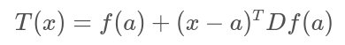
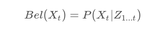

# Localization

## Table of contents
* [What is localization?](#what-is-localization)
* [Localization algorithms](#localization-algorithms)
  * [Extended Kalman Filter](#extended-kalman-filter)
    * [Gaussian distribution](#gaussian-distribution)
    * [Multivariate Gaussians](#multivariate-gaussians)
  * [Multidimensional KF](#multidimensional-kf)
  * [Multidimensional EKF](#multidimensional-ekf)
  * [Monte Carlo Localization](#monte-carlo-localization)
    * [Bayes filtering](#bayes-filtering)
    * [Quizzes: MCL](#quiz-mcl)
  * [MCL vs EKF](#MCL-vs-EKF)
* [Localization problems](#localization-problems)
* [Quiz: Localization](#quiz-localization)
* [Sensor fusion](#sensor-fusion)
* [Turtlebot](#turtlebot)

### What is localization?
Localization is the challenge of determining you robot's pose in a mapped environment.
A robot constraint to a plane can be described three state variables:
* **x** coordinate: position in _x_
* **y** coordinate: position in _y_
* **yaw**: orientation angle in _z_ axis

These are the variable naming conventions:
* **x<sub>t</sub>**: state
* **z<sub>t</sub>**: measurement
* **u<sub>t</sub>**: control action

  _t: obtained at time t_

### Localization algorithms
* Extended Kalman Filter or EKF (Gaussian filter): it helps in estimating the state of non-linear models.
* Markov Localization (base filter): it maintains a probability distribution over the set of all possible position and orientation the robot might be located at.
* Grid Localization (histogram filter): it is capable of estimating the robot's pose using grids.
* Monte Carlo Localization or MCL (particle filter): it estimates the robot's pose using particles.

#### Extended Kalman Filter
The Kalman filter is an estimation algorithm that is very prominent in controls. It's used to estimate the value of a variable (position, velocity, ...) in real time as the data is being collected. It can take data with a lot of uncertainty or noise in the measurements and provide a very accurate estimate of the real value. There are two-step process:
1. Measurement update: make use of the recorded measurement to update the robot's state. It is a weighted sum of the prior belief and the measurement. Calulation:

    * **μ**: Mean of the prior belief
    * **σ<sup>2</sup>**: Variance of the prior belief
    * **v**: Mean of the measurement
    * **r<sup>2</sup>**: Variance of the measurement

      **Quiz: New belief**

      
      Where do you think the robot's new belief will be? _A_

      The uncertainty of the prior is multiplied by the mean of the measurement, to give it more weight, and similarly the uncertainty of the measurement is multiplied with the mean of the prior:

      

      **Quiz: Variance calculation**

      What do you think? Would the variance of the new state estimate be less confident than our prior, in between our prior and measurement, or more confident than our measurement?

      _More confident than our measurement_


      This means that it has a higher peak and is narrower.

      

      The formula for the new variance is:

      

      * **τ**: Mean of the posterior
      * **s<sup>2</sup>**: Variance of the posterior

      **Code**
      ```cpp
      #include <iostream>
      #include <math.h>
      #include <tuple>

      using namespace std;

      double new_mean, new_var;

      tuple<double, double> measurement_update(double mean1, double var1, double mean2, double var2)
      {
        new_mean = (var2 * mean1 + var1 * mean2) / (var1 + var2);
        new_var = 1 / (1 / var1 + 1 / var2);
        return make_tuple(new_mean, new_var);
      }

      int main()
      {
        tie(new_mean, new_var) = measurement_update(10, 8, 13, 2);
        printf("[%f, %f]", new_mean, new_var);
        return 0;
      }
      ```

2. State prediction: make use of the information that we have about the current state to predict what the future state will be, starting from an initial estimate. It is the addition of the prior belief's mean and variance to the motion's mean and variance.

    

      **Code**
      ```cpp
      #include <iostream>
      #include <math.h>
      #include <tuple>

      using namespace std;

      double new_mean, new_var;

      tuple<double, double> state_prediction(double mean1, double var1, double mean2, double var2)
      {
        new_mean = mean1 + mean2;
        new_var =  var1 + var2;
        return make_tuple(new_mean, new_var);
      }

      int main()
      {
        tie(new_mean, new_var) = state_prediction(10, 4, 12, 4);
        printf("[%f, %f]", new_mean, new_var);
        return 0;
      }
      ```
  **Code**
  ```cpp
  #include <iostream>
  #include <math.h>
  #include <tuple>
  #include <assert.h>

  using namespace std;

  double new_mean, new_var;

  tuple<double, double> measurement_update(double mean1, double var1, double mean2, double var2)
  {
    new_mean = (var2 * mean1 + var1 * mean2) / (var1 + var2);
    new_var = 1 / (1 / var1 + 1 / var2);
    return make_tuple(new_mean, new_var);
  }

  tuple<double, double> state_prediction(double mean1, double var1, double mean2, double var2)
  {
    new_mean = mean1 + mean2;
    new_var = var1 + var2;
    return make_tuple(new_mean, new_var);
  }

  int main()
  {
    //Measurements and measurement variance
    double measurements[5] = { 5, 6, 7, 9, 10 };
    double measurement_sig = 4;

    //Motions and motion variance
    double motion[5] = { 1, 1, 2, 1, 1 };
    double motion_sig = 2;

    //Initial state
    double mu = 0;
    double sig = 1000;

    //######TODO: Put your code here below this line######//

    // Loop through all the measurments
    int measurements_size = sizeof(measurements) / sizeof(measurements[0]);
    assert(measurements_size == sizeof(motion) / sizeof(motion[0]));

    for (int i = 0; i < measurements_size; i++)
    {
      tie(mu, sig) = measurement_update(mu, sig, measurements[i], measurement_sig);
      // Apply a measurment update
      printf("update:  [%f, %f]\n", mu, sig);
      tie(mu, sig) = state_prediction(mu, sig, motion[i], motion_sig);
      // Apply a state prediction
      printf("predict: [%f, %f]\n", mu, sig);
    }
    return 0;
  }
  ```

The Kalman filter is often used to estimate the state of a system when the measurements are noisy. There is actually three common types:
1. KF -linear: for linear systems once where the output is proportinal to the input.
2. EKF nonlinear: for non-linear system.
3. UKF - highly nonlinear: Unscented Kalman Filter is appropriate for highly non-linear systems where EKF may fail to converge.

Sensor fusion technique uses the Kalman filter to calculate a more accurate estimate using data from multiple sensors. Once again, the Kalman filter takes into account  the uncertainty of each sensor's measurements.

**Equations**

These are the equations that implement the Extended Kalman Filter - you'll notice that most of them remain the same, with a few changes highlighted in red.


Highlighted in blue are the Jacobians that replaced the measurement and state transition functions.

The Extended Kalman Filter requires us to calculate the Jacobian of a nonlinear function as part of every single iteration, since the mean (which is the point that we linearize about) is updated.

**Summary**

Phew, that got complicated quickly! Here are the key take-aways about Extended Kalman Filters:

* The Kalman Filter cannot be used when the measurement and/or state transition functions are nonlinear, since this would result in a non-Gaussian distribution.
* Instead, we take a local linear approximation and use this approximation to update the covariance of the estimate. The linear approximation is made using the first terms of the Taylor Series, which includes the first derivative of the function.
* In the multi-dimensional case, taking the first derivative isn't as easy as there are multiple state variables and multiple dimensions. Here we employ a Jacobian, which is a matrix of partial derivatives, containing the partial derivative of each dimension with respect to each state variable.

While it's important to understand the underlying math to employ the Kalman Filter, don't feel the need to memorize these equations. Chances are, whatever software package or programming language you're working with will have libraries that allow you to apply the Kalman Filter, or at the very least perform linear algebra calculations (such as matrix multiplication and calculating the Jacobian).

**Quiz 1**

Let's look at another example of a vehicle taking measurements - this time, a quadrotor! This quadrotor is a bit simplified - it's motion is constrained to the y-axis. Therefore, it's state can be defined by the following vector,


that is: its roll angle, its velocity, and its position.

Imagine you have a quadrotor, such as the one in the image below. This quadrotor would like to know the distance between it and the wall. This is an important measurement to have if the quadrotor would like to traverse the inside of a room, or outside of a building, while maintaining a safe distance from the wall.

To estimate this distance, the quadrotor is equipped with a range finger.


Shown in blue, are the true distances from an arbitrary point on the left to the quadrotor, and to the wall.

_In the quadrotor's current configuration, what would you expect it's measurement to the wall to be?_

* h(x) = wall - y

**Quiz 2**

Now, what would happen if the quadrotor were to roll to some angle ϕ? What is a more general equation for the measurement that takes into account the roll angle?


_What is the equation for the measurement when the quadrotor has a roll angle of ϕ?_

* h(x) = (wall - y) / cosϕ

The function has a cosine in it's denominator, making this function non-linear. This means that we will need to use the Extended Kalman Filter for our estimation, and in the process, linearize the function.

**Quiz 3**

To apply the Extended Kalman Filter, we will need to calculate H, the Jacobian of the measurement model that we defined above. This won't be too strenuous since the measurement function is a 1x1 matrix.

Without calculating the partial derivatives, which of the following is the correct Jacobian for the measurement model?

_Select the correct Jacobian for the measurement model._


##### Gaussian distribution
At the basis of the Kalman Filter is the Gaussian distribution, sometimes referred to as a bell curve or normal distribution.

A Gaussian distribution is a probability distribution, which is a continuous function. The probability that a random variable, x, will take a value between x<sub>1</sub> and x<sub>2</sub> is given by the integral of the function from x<sub>1</sub> to x<sub>2</sub>:


A Gaussian is characterized by two parameters - its mean (μ) and its variance (σ²). The mean is the most probable occurrence and lies at the centre of the function, and the variance relates to the width of the curve. The term unimodal implies a single peak present in the distribution.

Gaussian distributions are frequently abbreviated as N(x: μ, σ²), and will be referred to in this way throughout the coming lessons.

The formula for the Gaussian distribution is printed below. Notice that the formula contains an exponential of a quadratic function. The quadratic compares the value of x to μ, and in the case that x=μ, the exponential is equal to 1 (e<sup>0</sup> = 1). You'll note here, that the constant in front of the exponential is a necessary normalizing factor.


Just like with discrete probability, like a coin toss, the probabilities of all the options must sum to one. Therefore, the area underneath the function always sums to one.


**Quiz: Gaussian**


If you had to pick a Gaussian to represent the location of your rover, which of the following would you prefer? *A*

What is represented by a Gaussian distribution?
* Predicted Motion
* Sensor Measurement
* Estimated State of Robot

**Quiz: Distribution**


Can a state with this probability distribution be solved using the Kalman Filter? *No*

**Code**
Calculate the probability of a value occurring given a mean and a variance:
```cpp
#include <iostream>
#include <math.h>

using namespace std;

double f(double mu, double sigma2, double x)
{
  double prob = 1.0 / sqrt(2.0 * M_PI * sigma2) * exp(-0.5 * pow((x - mu), 2.0) / sigma2);
  return prob;
}

int main()
{
  cout << f(10.0, 4.0, 8.0) << endl;
  return 0;
}
```

##### Multivariate Gaussians


Note: σ<sub>x</sub>σ<sub>y</sub> = σ<sub>y</sub>σ<sub>x</sub>

Where σ²<sub>x</sub> and σ²<sub>y</sub> represent the variances, while σ<sub>y</sub>σ<sub>x</sub> and σ<sub>x</sub>σ<sub>y</sub> are correlation terms. These terms are non-zero if there is a correlation between the variance in one dimension and the variance in another. When that is the case, the Gaussian function looks 'skewed' when looked at from above.

If we were to evaluate this mathematically, the eigenvalues and eigenvectors of the covariance matrix describe the amount and direction of uncertainty.


Note: that _x_ and _μ_ are vectors, and _Σ_ is a matrix.

* **Quiz: Multivariate Gaussians**
Why couldn't we use multiple 1-dimensional Gaussians to represent multi-dimensional systems?

_There may be correlations between dimensions that we would not be able to model by using independent 1-dimensional Gaussians.

#### Multidimensional KF
In multidimensional states, there may exist hidden state variables, once that you cannot measure with the sensors available.

**State Transition**

The formula below is the state transition function that advances the state from time _t_ to time _t + 1_. It is just the relationship between the robot's position, xx, and velocity, ẋ. Here, we will assume that the robot's velocity is not changing.


We can express the same relationship in matrix form, as seen below. On the left, is the posterior state (denoted with the prime symbol, _´_), and on the right are the state transition function and the prior state. This equation shows how the state changes over the time period, Δt. Note that we are only working with the means here; the covariance matrix will appear later.


The State Transition Function is denoted _F_, and the formula can be written as so,


In reality, the equation should also account for process noise, as its own term in the equation. However, process noise is a Gaussian with a mean of 0, so the update equation for the mean need not include it.


Now, what happens to the covariance? How does it change in this process?

**Sidenote**: While it is common to use Σ to represent the covariance of a Gaussian distribution in mathematics, it is more common to use the letter _P_ to represent the state covariance in localization.
If you multiply the state, _x_, by _F_, then the covariance will be affected by the square of _F_. In matrix form, this will look like so:


However, your intuition may suggest that it should be affected by more than just the state transition function. For instance, additional uncertainty may arise from the prediction itself. If so, you're correct!

To calculate the posterior covariance, the prior covariance is multiplied by the state transition function squared, and _Q_ added as an increase of uncertainty due to process noise. _Q_ can account for a robot slowing down unexpectedly, or being drawn off course by an external influence.


Now we've updated the mean and the covariance as part of the state prediction.

**Quiz 1**

You are tracking the position and velocity of a robot in two dimensions, _x_ and _y_. The state is represented as so,


Find the state update function, F, that will advance the state from time _t_ to time _t + 1_ based on the state transition equation below.


Which of the following matrices is the correct state transition function for the problem defined above?


**Quiz 2:**
You are tracking the position, velocity, and acceleration of a quadrotor in the vertical dimension, _z_. The state of the quadrotor can be represented as so,


Find the state update function, F, that will advance the state from time _t_ to time _t + 1_ based on the state transition equation below.


Which of the following matrices is the correct state transition function for the problem defined above?


**Measurement Update**

 If we return to our original example, where we were tracking the position and velocity of a robot in the x-dimension, the robot was taking measurements of the location only (the velocity is a hidden state variable). Therefore the measurement function is very simple - a matrix containing a one and a zero. This matrix demonstrates how to map the state to the observation, _z_.


This matrix, called the Measurement Function, is denoted _H_.

For the measurement update step, there are a few formulas. First, we calculate the measurement residual, _y_. The measurement residual is the difference between the measurement and the expected measurement based on the prediction (ie. we are comparing where the measurement _tells us_ we are vs. where we _think_ we are). The measurement residual will be used later on in a formula.


Next, it's time to consider the measurement noise, denoted _R_. This formula maps the state prediction covariance into the measurement space and adds the measurement noise. The result, _S_, will be used in a subsequent equation to calculate the Kalman Gain.


**Kalman Gain**

Next, we calculate the Kalman Gain, K. As you will see in the next equation, the Kalman Gain determines how much weight should be placed on the state prediction, and how much on the measurement update. It is an averaging factor that changes depending on the uncertainty of the state prediction and measurement update.


The last step in the Kalman Filter is to update the new state's covariance using the Kalman Gain.


**Kalman Filter Equations**

These are the equations that implement the Kalman Filter in multiple dimensions.


The Kalman Filter can successfully recover from inaccurate initial estimates, but it is very important to estimate the noise parameters, Q and R, as accurately as possible - as they are used to determine which of the estimate or the measurement to believe more.

**Kalman Assumptions**
* Motion and measurement models are linear
* State space can be represented by a unimodal Gaussian distribution

_Summary_:

The Kalman Filter is applicable to problems with linear motion and measurement functions. This is limiting, as much of the real world is nonlinear.

A nonlinear function can be used to update the mean of a function,


but not the variance, as this would result in a non-Gaussian distribution which is much more computationally expensive to work with. To update the variance, the Extended Kalman Filter linearizes the nonlinear function f(x) over a small section and calls it F. This linearization, F, is then used to update the state's variance.


The linear approximation can be obtained by using the first two terms of the Taylor Series of the function centered around the mean.


**Programming Exercise**

```cpp
#include <iostream>
#include <math.h>
#include <tuple>
#include "Core" // Eigen Library
#include "LU"   // Eigen Library

using namespace std;
using namespace Eigen;

float measurements[3] = { 1, 2, 3 };

tuple<MatrixXf, MatrixXf> kalman_filter(MatrixXf x, MatrixXf P, MatrixXf u, MatrixXf F, MatrixXf H, MatrixXf R, MatrixXf I)
{
  for (int n = 0; n < sizeof(measurements) / sizeof(measurements[0]); n++)
  {
    // Measurement Update
    MatrixXf Z(1, 1);
    Z << measurements[n];

    MatrixXf y(1, 1);
    y << Z - (H * x);

    MatrixXf S(1, 1);
    S << H * P * H.transpose() + R;

    MatrixXf K(2, 1);
    K << P * H.transpose() * S.inverse();

    x << x + (K * y);

    P << (I - (K * H)) * P;

    // Prediction
    x << (F * x) + u;
    P << F * P * F.transpose();
  }
  return make_tuple(x, P);
}

int main()
{
  MatrixXf x(2, 1);// Initial state (location and velocity)
  x << 0,
  	   0;
  MatrixXf P(2, 2);//Initial Uncertainty
  P << 100, 0,
  	   0, 100;
  MatrixXf u(2, 1);// External Motion
  u << 0,
  	   0;
  MatrixXf F(2, 2);//Next State Function
  F << 1, 1,
  	   0, 1;
  MatrixXf H(1, 2);//Measurement Function
  H << 1,
  	   0;
  MatrixXf R(1, 1); //Measurement Uncertainty
  R << 1;
  MatrixXf I(2, 2);// Identity Matrix
  I << 1, 0,
  	   0, 1;
  tie(x, P) = kalman_filter(x, P, u, F, H, R, I);
  cout << "x= " << x << endl;
  cout << "P= " << P << endl;

  return 0;
}
```

#### Multidimensional EKF

Now you've seen the fundamentals behind the Extended Kalman Filter. The mechanics are not too different from the Kalman Filter, with the exception of needing to linearize a nonlinear motion or measurement function to be able to update the variance.

You've seen how this can be done for a state prediction or measurement function that is of one-dimension, but now it's time to explore how to linearize functions with multiple dimensions. To do this, we will be using multi-dimensional Taylor series.

**Linearization in multiple dimensions**

The equation for a multidimensional Taylor Series is presented below.


You will see that it is very similar to the 1-dimensional Taylor Series. As before, to calculate a linear approximation, we only need the first two terms.



You may notice a new term, Df(a). This is the Jacobian matrix, and it holds the partial derivative terms for the multi-dimensional equation.


In it's expanded form, the Jacobian is a matrix of partial derivatives. It tells us how each of the components of f changes as we change each of the components of the state vector.


The rows correspond to the dimensions of the function, f, and the columns relate to the dimensions (state variables) of x. The first element of the matrix is the first dimension of the function derived with respect to the first dimension of x.

The Jacobian is a generalization of the 1-dimensional case. In a 1-dimensional case, the Jacobian would have df/dx as its only term.

### Monte Carlo Localization
Monte Carlo Localization or MCL uses particles to localize your robot. Each of the particles has a position (x, y), orientation, weight (robot's actual pose and the particle's predicted pose, the bigger the more accurate it is) and represent a guess of where your robot might be located. These particles are re-sampled each time the robot moves and sense its environment. MCL is limited only to local and global localization problem. So, you lose sight of your robot if someone hacks into it.

#### Bayes filtering
The powerful Monte Carlo localization algorithm estimates the posterior distribution of a robot's position and orientation based on sensory information. This process is known as a recursive `Bayes filter`.

Using a Bayes filtering approach, roboticists can estimate the **state** of a **dynamical system** from sensor **measurements**.

In mobile robot localization, it's important to be acquainted with the following definitions:
* **Dynamical system**: The mobile robot and its environment
* **State**: The robot's pose, including its position and orientation.
* **Measurements**: Perception data(e.g. laser scanners) and odometry data(e.g. rotary encoders)

The goal of Bayes filtering is to estimate a probability density over the state space conditioned on the measurements. The probability density, or also known as **posterior** is called the **belief** and is denoted as:



Where,
* X<sub>t</sub>: `State` at time t
* Z<sub>1...t</sub>: `Measurements` from time 1 up to time t

**Probability**

Given a set of probabilities, **P(A|B)** is calculated as follows:


**Quiz**


This robot is located inside of a 1D hallway which has three doors. The robot doesn't know where it is located in this hallway, but it has sensors onboard that can tell it, with some amount of precision, whether it is standing in front of a door, or in front of a wall. The robot also has the ability to move around - with some precision provided by its odometry data. Neither the sensors nor the movement is perfectly accurate, but the robot aims to locate itself in this hallway.

The mobile robot is now moving in the 1D hallway and collecting odometry and perception data. With the odometry data, the robot is keeping track of its current position. Whereas, with the perception data, the robot is identifying the presence of doors.

In this quiz, we are aiming to calculate the state of the robot, given its measurements. This is known by the belief: **P(Xt|Z)!**

Given:
* **P(POS)**: The probability of the robot being at the actual position
* **P(DOOR|POS)**: The probability of the robot seeing the door given that it's in the actual position
* **P(DOOR|¬POS)**: The probability of the robot seeing the door given that it's not in the actual position

Compute:
* **P(POS|DOOR)**: The belief or the probability of the robot being at the actual position given that it's seeing the door.
```cpp
#include <iostream>
using namespace std;

int main()
{
	//Given P(POS), P(DOOR|POS) and P(DOOR|¬POS)
	double a = 0.0002 ; //P(POS) = 0.002
	double b = 0.6    ; //P(DOOR|POS) = 0.6
	double c = 0.05   ; //P(DOOR|¬POS) = 0.05
	//Compute P(¬POS) and P(POS|DOOR)
	double d = 1-a;                  //P(¬POS)
	double e = (b*a)/((a*b)+(d*c));  //P(POS|DOOR)
	//Print Result
	cout << "P(POS|DOOR)= " << e << endl;

	return 0;
}
```

#### Quizzes: MCL
* Which localization problems can MCL solve?
  - Local
  - Global

* How is MCL different from other localization algorithms?
  - MCL uses particles to localize the robot pose
  - MCL can approximate almost any state space distribution

* Choose the correct answer regarding MCL
  - None of the above

* Order of the MCL algorithm
  1. Previous Belief
  2. Motion Update
  3. Measurement Update
  4. Resampling
  5. New Belief

* Does the orientation of particles play a role in estimating the robot's pose?
  - Yes, definitely!

* Programming quiz: Fist interaction

  Now that you’ve reviewed the Robot class, it’s time to **interact** with it. In this quiz, you will be asked to fill in the missing **values** and **statements** to simulate robot motion.
  ```cpp
  int main()
  {
    // Instantiating a robot object from the Robot class
    Robot myrobot;

    // TODO: Set robot new position to x=10.0, y=10.0 and orientation=0
    // Fill in the position and orientation values in myrobot.set() function
    myrobot.set(10.0, 10.0, 0.0);

    // Printing out the new robot position and orientation
    cout << myrobot.show_pose() << endl;

    // TODO: Rotate the robot by PI/2.0 and then move him forward by 10.0
    // Use M_PI for the pi value
    myrobot.move(M_PI/2.0, 10.0);

    // TODO: Print out the new robot position and orientation
    std::cout << myrobot.show_pose() << std::endl;

    // Printing the distance from the robot toward the eight landmarks
    cout << myrobot.read_sensors() << endl;

    return 0;
  }
  ```

* Programming quiz: Motion and Sensing

  In the previous lesson, you’ve learned how to interact with the Robot class. Now, you’ll be asked to **instantiate** a robot object, simulate **motion** update and **sensor** update similar to what you’ve learned in the first quiz.
  ```cpp
  int main()
  {
    // TODO: Instantiate a robot object from the Robot class
    Robot my_robot;

    // TODO: Set robot new position to x=30.0, y=50.0 and orientation=PI/2
    my_robot.set(30.0, 50.0, M_PI/2.0);

    // TODO: Turn clockwise by PI/2 and move by 15 meters
    my_robot.move(-M_PI/2.0, 15.0);

    // TODO: Print the distance from the robot toward the eight landmarks
    std::cout << my_robot.read_sensors() << std::endl;

    // TODO: Turn clockwise by PI/2 and move by 10 meters
    my_robot.move(-M_PI/2.0, 10.0);

    // TODO: Print the distance from the robot toward the eight landmarks
    std::cout << my_robot.read_sensors() << std::endl;

    return 0;
  }
  ```

* Programming quiz: Noise

  You’ll now alter the robot’s **pose** and **measurement** values to **noisy** ones. Add the following noise values:
  - `Forward Noise`=5.0
  - `Turn Noise`=0.1
  - `Sense Noise`=5.0.
  ```cpp
  int main()
  {
    Robot myrobot;
    // TODO: Simulate Noise
    // Forward Noise=5.0, Turn Noise=0.1,Sense Noise=5.0
    double Forward_Noise = 5.0;
    double Turn_Noise = 0.1;
    double Sense_Noise = 5.0;
    myrobot.set_noise(Forward_Noise, Turn_Noise, Sense_Noise);

    myrobot.set(30.0, 50.0, M_PI / 2.0);
    myrobot.move(-M_PI / 2.0, 15.0);
    cout << myrobot.read_sensors() << endl;
    myrobot.move(-M_PI / 2.0, 10.0);
    cout << myrobot.read_sensors() << endl;

    return 0;
  }
  ```

* Programming quiz: Generating Particles

  You'll first **generate** 1000 particles by uniformly and randomly spreading them in the 2D map. To replicate real world conditions, you’ll **simulate noise** and add random Gaussian digits to the particle forward, turn and sensing values.
  ```cpp
  int main()
  {
    //Practice Interfacing with Robot Class
    Robot myrobot;
    myrobot.set_noise(5.0, 0.1, 5.0);
    myrobot.set(30.0, 50.0, M_PI / 2.0);
    myrobot.move(-M_PI / 2.0, 15.0);
    //cout << myrobot.read_sensors() << endl;
    myrobot.move(-M_PI / 2.0, 10.0);
    //cout << myrobot.read_sensors() << endl;

    //####   DON'T MODIFY ANYTHING ABOVE HERE! ENTER CODE BELOW ####

    // Instantiating 1000 Particles each with a random position and orientation
    int n = 1000;
    Robot p[n];
    //TODO: Your job is to loop over the set of particles
    for (int i = 0; i < n; i++)
    {
      //TODO: For each particle add noise: Forward_Noise=0.05, Turn_Noise=0.05, and Sense_Noise=5.0
      p[i].set_noise(0.05, 0.05, 5.0);
      //TODO: And print its pose on a single line
      std::cout << p[i].show_pose() << std::endl;
    }
    return 0;
  }
  ```

* Programming quiz: Simulating Motion

  Now that you've generated the particles, you’ll **simulate** motion for each one of them by **rotating** them and **moving** them forward.
  ```cpp
  int main()
  {
    //Practice Interfacing with Robot Class
    Robot myrobot;
    myrobot.set_noise(5.0, 0.1, 5.0);
    myrobot.set(30.0, 50.0, M_PI / 2.0);
    myrobot.move(-M_PI / 2.0, 15.0);
    //cout << myrobot.read_sensors() << endl;
    myrobot.move(-M_PI / 2.0, 10.0);
    //cout << myrobot.read_sensors() << endl;

    // Create a set of particles
    int n = 1000;
    Robot p[n];

    for (int i = 0; i < n; i++) {
        p[i].set_noise(0.05, 0.05, 5.0);
        //cout << p[i].show_pose() << endl;
    }

    //####   DON'T MODIFY ANYTHING ABOVE HERE! ENTER CODE BELOW ####

    //Now, simulate motion for each particle
    //TODO: Create a new particle set 'p2'
    Robot p2;
    //TODO: Rotate each particle by 0.1 and move it forward by 5.0
    p2.move(0.1, 5.0);
    //TODO: Assign 'p2' to 'p' and print the particle poses, each on a single line
    for (int i = 0; i < n; i++)
    {
      p[i] = p2;
      std::cout << p[i].show_pose() << endl;
    }

    Robot p2[n];
    for (int i = 0; i < n; i++) {
        p2[i] = p[i].move(0.1, 5.0);
        p[i] = p2[i];
        cout << p[i].show_pose() << endl;
    }

    return 0;
  }
  ```

* Programming quiz: Resampling Wheel

  Now that you’ve learned the **resampling** wheel pseudo code, you'll try to implement it in C++. In this quiz, resample the particles with a sample probability proportional to the importance weight
  ```cpp
  //####   DON'T MODIFY ANYTHING ABOVE HERE! ENTER CODE BELOW ####

  //TODO: Resample the particles with a sample probability proportional to the importance weight
  Robot p3[n];
  int index = gen_real_random() * n;
  double beta = 0.0;
  double w_max = max(w, n);

  for (int i = 0; i < n; i++)
  {
    beta += gen_real_random() * 2.0 * w_max;
    while (beta > w[index])
    {
      beta -= w[index];
      index = mod((index + 1), n);
    }
    p3[i] = p[index];
  }
  for (int k=0; k < n; k++)
  {
    p[k] = p3[k];
    cout << p[k].show_pose() << endl;
  }
  ```

* Programming quiz: Error

  You’ve just coded the MCL algorithm, and now you should evaluate the overall quality of your solution. To do so, you’ll need to compute the average distance between the particles and the robot. A good solution will result in an average distance smaller than a meter. Now, use the evaluation function and compute the average distance, or error at each iteration.
  ```cpp
  //####   DON'T MODIFY ANYTHING ABOVE HERE! ENTER CODE BELOW ####

  // TODO: Evaluate the error by priting it in this form:
  // cout << "Step = " << t << ", Evaluation = " << ErrorValue << endl;
  cout << "Step = " << t << ", Evaluation = " << evaluation(myrobot, p, n) << endl;
  ```

### MCL vs EKF


MCL:


At time:
* t=1, Particles are drawn randomly and uniformly over the entire pose space.
* t=2, Measurement is updated and an importance weight is assigned to each particle.
* t=3, Motion is updated and a new particle set with uniform weights and high number of particles around the three most likely places is obtained in resampling.
* t=4, Measurement assigns non-uniform weight to the particle set.
* t=5, Motion is updated and a new resampling step is about to start.

EKF:


At time:
* t=1, Initial belief represented by a Gaussian distribution around the first door.
* t=2, Motion is updated and the new belief is represented by a shifted Gaussian of increased weight.
* t=3, Measurement is updated and the robot is more certain of its location. The new posterior is represented by a Gaussian with a small variance.
* t=4, Motion is updated and the uncertainty increases.

**Quiz**
Select concepts that are common to both the MCL and EKF algorithms:
* Gaussian distribution
* Motion and measurement stages

### Localization problems
* Position Tracking or Local Localization: it is the easiest localization problem. The robot knows its initial pose and it has to estimate the its pose as it moves out on the environment.
* Global Localization: it is more complicated localization. The robot's initial pose is unknown and it must determine its pose relative to the ground truth map.
* Kidnapped Robot: it is the most challenging localization problem. It is like Global Localization except that the robot may be kidnapped at any time and moved to a new location on the map.

### Quiz: Localization
The following statements are correct:
* In global localization, the robot's initial pose is unknown.
* The position tracking problem is easier to solve than the global localization one.
* In the kidnapped robot problem, the robot is teleported to a different location.

### Sensor fusion
Each sensor of the robot has limitations which manifest as noise and error. The three most common types of mobile robot sensors are:
* Inertial measurement unit (IMU): It can measure linear acceleration and the angular velocity.
* Rotary encoders: They are attached to the robot's actuated wheels and  measures the velocity and position of the wheels.
* Vision sensors: It is usually and RGB-D camera that captures images and sense  the depth towards the obstacle which can be translated to a position.

The IMU and encoders are prone to drift, whereas the camera might not always operate as expected. That's why a sensor fusion of at least two of them is usually required.

### Turtlebot
The turtlebot is one of the famous robots used by roboticists around the world to perform localization, mapping and path planning. There are three versions:
1. Introduced in 2010 with an iRobot Case base.
2. Introduced in 2012 with the Kobuki base.
3. Introduced in 2017
