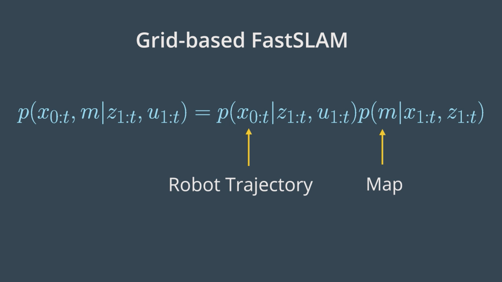
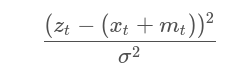
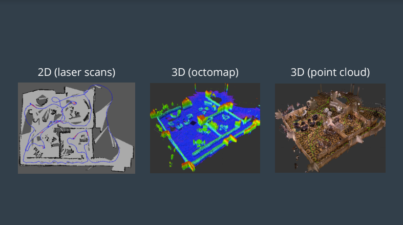

# Mapping and SLAM

## Table of contents
* [Mapping](#mapping)
  * [Challenges and Difficulties](#challenges-and-difficulties)
  * [Mapping with known poses](#mapping-with-known-poses)
  * [Posterior Probability](#posterior-probability)
  * [Grid cells](#grid-cells)
  * [Computing the Posterior](#computing-the-posterior)
  * [Filtering](#filtering)
  * [Binary Bayes Filter Algorithm](#binary-bayes-filter-algorithm)
  * [Occupancy Grid Mapping algorithm](#occupancy-grid-mapping-algorithm)
  * [Inverse Sensor Model](#inverse-sensor-model)
  * [Multi Sensor Fusion](#multi-sensor-fusion)
  * [3D Mapping](#3d-mapping)
    * [3D Data representations](#3d-data-representations)
    * [3D Octomap](#3d-octomap)
  * [Quizzes: mapping](#quizzes-mapping)
* [SLAM](#slam)
  * [Online SLAM](#online-slam)
  * [Full SLAM](#full-slam)
  * [Nature of SLAM](#nature-of-slam)
  * [Correspondence](#correspondence)
  * [SLAM Challenges](#slam-challenges)
  * [Particle Filter Approach to SLAM](#particle-filter-approach-to-slam)
  * [FastSLAM algorithm](#fastslam-algorithm)
    * [FastSLAM Instances](#fastslam-instances)
    * [Adapting FastSLAM to Grid Maps](#adapting-fastslam-to-grid-maps)
    * [Grid-based FastSLAM Techniques](#grid-based-fastslam-techniques)
    * [Grid-based FastSLAM algorithm](#grid-based-fastslam-algorithm)
  * [SLAM with ROS](#slam-with-ros)
  * [GraphSLAM algorithm](#graphslam-algorithm)
    * [Maximum Likelihood Estimation](#maximum-likelihood-estimation)
    * [n-Dimensional Graphs](#n-dimensional-graphs)
    * [Information Matrix and Vector](#information-matrix-and-vector)
    * [Inference](#inference)
    * [Nonlinear Constraints](#nonlinear-constraints)
  * [Appearance-Based SLAM](#appearance-based-slam)
    * [3D SLAM with RTAB-MAP](#3d-slam-with-rtab-map)
    * [Visual Bag-of-Words](#visual-bag-of-words)
    * [RTAB-Map Memory Management](#rtab-map-memory-management)
    * [RTAB-Map Optimization and Output](#rtab-map-optimization-and-output)
  * [Quizzes: SLAM](#quizzes-slam)

### Mapping
Robot mapping instead of assuming an old map and estimating your pose, you're assuming an old path and estimating your environment.

Mapping usally happens after SLAM with known poses. The power of mapping is in its post-processing.

**Discrete Data**: You obtain this data by counting it. This data has finite values. _Example_: `Number` of robots in a room.

**Continuous Data**: You obtain this data by measuring it. This data has an infinite number of steps, which form a continuum. _Example_: `Weight` of a robot.

#### Challenges and Difficulties
Mapping with mobile robots is a challenging problem for two main reasons:
1. Unknown Map and Poses

    If the map is unknown to us, we'll either have to assume known poses and estimate the map (1) or assume unknown poses and estimate the map and the poses relative to it (2):
    1. Estimating the map on unknown poses is a challenging problem because of the large number of variables. This can be solved using the occupancy grid mapping algorithm.
    2. Even more challenging, is to estimate the map and the poses relative to it.
2. Huge Hypothesis Space

    The hypothesis space is the space of all possible maps that can be formed during mapping. This space is highly dimensional since maps are defined over a continuous space. The challenge is to estimate the full posterior map.

Difficulties while mapping an environment:
1. Size of the environment (amount of data to be processed)
2. Noise in perception sensors, odometry sensors and actuators.
3. Perceptual ambiguity when two places looks alike and the robot must correlate between them which the robot travels through at different points in time.
4. Cycles (going back and forth in a corridor). When traveling in cycles, robot odometry incrementally accumulates error.

#### Mapping with known poses
The problem of generating a map under the assumption that the robot poses are known and non noisy is referred to as mapping with known poses.

The occupancy grid mapping algorithm can estimate the posterior map giving noisy measurements and known poses.

#### Posterior Probability


With this function, we can compute the posterior over the map given all the measurements up to time **t** and all the poses up to time **t** represented by the robot trajectory.

In estimating the map, we'll exclude the controls **u** since the robot path is provided to us from SLAM. However, keep in mind that the robot controls will be included later in SLAM to estimate the robot's trajectory.

#### Grid cells
To estimate the posterior map, the occupancy grid will uniformly partition the two-dimensional space in a finite number of grid cells. Each of these grid cells will hold the miner random value that corresponds to the location it covers.


#### Computing the Posterior


We just saw that maps have high dimensionality so it will be too pricey in terms of computational memory to compute the posterior under this first approach.


A second or better approach to estimating the posterior map is to decompose this problem into many separate problems. In each of these problems, we will compute the posterior map **m<sub>i</sub>** at each instant. However, this approach still presents some drawbacks because we are computing the probability of each cell independently. Thus, we still need to find a different approach that addresses the dependencies between neighboring cells.


Now, the third approach is the best approach to computing the posterior map by relating cells and overcoming the huge computational memory, is to estimate the map with the product of marginals or factorization.

#### Filtering
Grid cells holds a static stat that do not change over time. Meaning that the state of the system does not change during sensing.

Locally, a filter to this problem exists, and is known as the Binary Bayes Filter. It solves the static problems by taking the log odds ratio of the belief. With static state, the belief is now a function of the measurements only.

Depending on the measurement values reflected, the state of the grid cells is updated, and this belief is known by the Inverse Measurement Model which represents the binary state of grid cells with respect to measurements.

**Forward Measurement Model** - P(z<sub>1:t</sub>|x): estimating a posterior over the measurement given the system state.

**Inverse Measurement Model** - P(x|z<sub>1:t</sub>): Estimating a posterior over the system state given the  measurement.

The inverse measurement model is generally used when measurements are more complex than the binary static state.

The advantage of using a log odds ratio representation is to avoid probability instabilities near 0 or 1. Another advantage relates to system speed, accuracy, and simplicity

#### Binary Bayes Filter Algorithm


**Input**

The binary Bayes filter algorithm computes the log odds of the posterior belief denoted by **l<sub>t</sub>**. Initially, the filter takes the previous log odds ratio of the belief **<sub>t-1</sub>** and the measurements **z<sub>t</sub>** as parameters.

**Computation**

Then, the filter computes the new posterior belief of the system **l<sub>t</sub>** by adding the previous belief **l<sub>t-1</sub>** to the log odds ratio of the inverse measurement model  and subtracting the prior probability state also known by initial belief . The initial belief represents the initial state of the system before taking any sensor measurements into consideration.

**Output**

Finally, the algorithm returns the posterior belief of the system **l<sub>t</sub>**, and a new iteration cycle begins.

#### Occupancy Grid Mapping algorithm
The Occupancy Grid Mapping algorithm implements a binary base filter to estimate the occupancy value of each cell.

Initially, the algorithm takes the previous occupancy values of the cells, the poses and measurements as parameters. Now, it loops through all the grid cells. For each of the cells, the algorithm tests if the cells are currently being sensed by the range finder sensors.


#### Inverse Sensor Model

Summary of notations for the sonar rangefinder inverse sensor model:
* `m<sub>i</sub>`: Map at instant i or current cell that is being processed
* `x<sub>i</sub>, y<sub>i</sub>`: Center of mass of the current cell m<sub>i</sub>
* `r`: Range of the center of mass computed with respect to robot pose and center of mass
* `k`: The sonar rangefinder cone that best aligns with the cell being considered computed with respect to the robot pose (x, y, θ), center of mass (x<sub>i</sub>, y<sub>i</sub>), and sensor angle.
* `β`: Opening angle of the conical region formed out of the measurement beams.
* `α`: Width of obstacles which is almost equal to the size of a cell. Please not that alpha is not the width of the conical region as the video mention but instead it's the width of a cell.


#### Multi Sensor Fusion
For example, an RGB-D camera might detect an obstacle at
a particular location but this object might not be seen by the laser beams of a LIDAR, and thus the LIDAR will process it as a free space.

The best approach to the multi sensor fusion problem is to build separate maps for each sensor type independently of each other and then integrate them.

Within the same environment, both maps do not look the same since each sensor has a different sensitivity.


#### 3D Mapping
3D mapping would give us the most reliable collision avoidance, and motion and path planning, especially for flying robots or mobile robots with manipulators.

To create 3D maps, robots sense the environment by taking 3D range measurements. This can be done using numerous technologies.

3D lidar can be used, which is a single sensor with an array of laser beams stacked horizontally. Alternatively, a 2D lidar can be tilted (horizontally moving up and down) or rotated (360 degrees) to obtain 3D coverage.

An RGBD camera is a single visual camera combined with a laser rangefinder or infrared depth sensor, and allows for the determination of the depth of the image, and ultimately the distance from an object. A stereo camera is a pair of offset cameras, and can be used to directly infer the distance of close objects, in the same way as humans do with their two eyes.

A single camera system is cheaper and smaller, but the software algorithms needed for monocular SLAM are much more complex. Depth cannot be directly inferred from the sensor data of a single image from a single camera. Instead, it is calculated by analysing data from a sequence of frames in a video.

##### 3D Data representations
Some of the desired characteristics of an optimal representation:
* Probabilistic data representations can be used to accommodate for sensor noise and dynamic environments.
* It is important to be able to distinguish data that represents an area that is free space versus an area that is unknown or not yet mapped. This will enable the robot to plan an unobstructed path and build a complete map.
* Memory on a mobile robot is typically a limited resource, so memory efficiency is very important. The map should also be accessible in the robot's main memory, while mapping a large area over a long period of time. To accomplish this, we need a data representation that is compact and allows for efficient updates and queries.

**2.5D maps**, also known as height maps, store the surface of the entire environment as the maximum height measured at every point. They are memory efficient, with constant access time. This type of mapping is not very useful if you have terrain with trees or overhang structures, where the robot could move underneath. Also, height maps are non-probabilistic. Similar to point clouds, there is also no distinction between free and unknown space.

**Elevation maps** are 2D grids that store an estimated height, or elevation, for each cell. A Kalman filter is used to estimate the height, and can also incorporate the uncertainty of the measurement process itself, which typically increases with the measured distance. One problem with elevation maps is the vertical wall - you can tell there is a vertical object but don't know exactly how tall it is.

**Extended elevation maps** store a set of estimated heights for every cell, and include cells that contain gaps. You can check whether the variance of the height of all data points within each cell is large. If so, you can investigate whether the corresponding set of points contains a gap exceeding the height of the robot (known as a “gap cell"), and ultimately use gap cells to determine traversability.

In **multi-level surface (MLS)** map representations, each 2D cell stores “patches", of which there can be multiple per cell. Each patch contains 3 key pieces of information - the height mean, the height variance, and the depth value. The height mean is the estimated height of the individual vertical area, also referred to as an interval. The uncertainty of the height is stored as the height variance, with the assumption that the error is represented by a Gaussian distribution. The depth value is defined by the difference between height of the surface patch and the height of the lowest measurement that is considered as belonging to that vertical object (ex the depth of the floor would be 0). Individual surfaces can be directly calculated, allowing the robot to deal with vertical and overhanging objects. This method also works very well with multi-level traversable surfaces, such as a bridge that you could travel over top of, or underneath, or a structure like a parking garage. An MLS map isn't a volumetric representation, but a discretization in the vertical dimension. Unknown areas are not represented, and localization for this method is not straightforward.

##### 3D Octomap
The OctoMap framework is an open-source C++ library and ROS package based on Octrees, and it can be used to generate volumetric 3D models.

It is not a 3D slim solution. It is the mapping framework and requires a pose estimate. It converts and integrates point clouds into 3D occupancy maps.

OctoMap uses:
* Probabilistic occupancy estimation modeled as a recursive Binary Bayes Filter. It is a static state filter, which assumes the environment doesn't change.
* Efficient updates are achieved using the log odds notation.

Ocupancy is represented volumetrically with modeling of free, occupied, and unmapped areas. Upper and lower bounds are placed on the log odds value of the occupancy estimate. This policy limits the number of updates required to change the state of the voxel.

OctoMap supports multi-resolution map queries where the minimum voxel size determines the resolution.

Tree pruning is also used to reduce redundant information between discrete occupancy states. Pruning is accomplished by defining a threshold probability that the voxel is occupied or free. Children that are identical to the parent in the tree can be pruned.

Memory efficient representation is accomplished using a compressin method that produces compact map files. Coherent map volumnes are locally combined, including both mapped free areas and occupied space.

#### Quizzes: mapping
**Importance of Mapping**

You just saw the importance of mapping in **dynamic** environments but what about **static** environments, are you still required to perform instantaneous mapping even if a priori map is available to you? _Yes_

**Challenges and Difficulties**

A mobile robot is mapping a large environment while traveling in cycles and correlating between different objects seen at different points in time. What are the challenges and difficulties faced by this robot?
* Challenge - Unknown Map
* Challenge - Huge Hypothesis space
* Difficulty - Size
* Difficulty - Noise
* Difficulty - Perceptual Ambiguity
* Difficulty - Cycles

**Mapping with known poses**

What are the **inputs** and **outputs** to the Mapping with Known Poses problem?

* **Inputs**: Poses + Measurements, **Output**: Map

**Posterior probability**

Match the **robotic problems** with their corresponding **probability equations**:


**Grid cells**

In this 3x3 two-dimensional grid map, how many **obstacles** exist? And how many **combinations** of maps can be formed?
```
1 0 1
0 1 0
1 0 1
```
**Obstacles** = 5, **Combinations** = 512

**Computing the Posterior**

In this quiz, we'll get you back to your calculus where you will try to remember how to evaluate this function:


Solution:


**Filtering**

A robot is trying to measure its distance towards the closest wall, its position is known. What type of measurement model would you implement to solve this problem?

* Forward Measurement Model

What is the log odds ratio representation of p(A|B)? Select all that apply


**Occupancy Grid Mapping algorithm code**

* **Data Files**
  1. `measurement.txt`:The measurements from the sonar rangefinder sensors attached to the robot at each time stamp recorded over a period of 413 seconds. (timestamp, measurement 1:8).
  2. `poses.txt`: The exact robot poses at each timestamp recorded over a period of 413 seconds. (timestamp, x, y, ϴ).
* **Global Functions**
  1. `inverseSensorModel()`: You'll code this function as part of your second quiz after learning the inverse sensor model for sonar rangefinder sensors.
  2. `occupancyGridMapping()`: You'll code this function as part of your first quiz.
* **Main Function**
  1. `File Scan`: Scanning both the measurement and poses files to retrieve the values. At each time stamp, the values are passed to the occupancy grid mapping function.
  2. `Display Map`: After processing all the measurements and poses, the map is displayed.

```cpp
void occupancyGridMapping(double Robotx, double Roboty, double Robottheta, double sensorData[])
{
  //1 - Generate a grid (size 300x150) and then loop through all the cells
  for (int x = 0; x < (mapWidth/gridWidth); x++)
  {
    for (int y = 0; y < (mapHeight/gridHeight); y++)
    {
      //2- Compute the center of mass of each cell xi and yi
      double xi = x * gridWidth + gridWidth / 2 - robotXOffset;
      double yi = -(y * gridHeight + gridHeight / 2) + robotYOffset;
      //3- Check if each cell falls under the perceptual field of the measurements
      if (sqrt(pow(xi - Robotx, 2) + pow(yi - Roboty, 2)) <= Zmax)
      {
        l[x][y] = l[x][y] + inverseSensorModel(Robotx, Roboty, Robottheta, xi, yi, sensorData) - l0;
      }
    }
  }
}
```

**Inverse Sensor Model algorithm code**

```cpp
double inverseSensorModel(double x, double y, double theta, double xi, double yi, double sensorData[])
{
  //******************Code the Inverse Sensor Model Algorithm**********************//
  // Defining Sensor Characteristics
  double Zk, thetaK, sensorTheta;
  double minDelta = -1;
  double alpha = 200, beta = 20;

  //******************Compute r and phi**********************//
  double r = sqrt(pow(xi - x, 2) + pow(yi - y, 2));
  double phi = atan2(yi - y, xi - x) - theta;

  //Scaling Measurement to [-90 -37.5 -22.5 -7.5 7.5 22.5 37.5 90]
  for (int i = 0; i < 8; i++)
  {
    if (i == 0)
      sensorTheta = -90 * (M_PI / 180);
    else if (i == 1)
      sensorTheta = -37.5 * (M_PI / 180);
    else if (i == 6)
      sensorTheta = 37.5 * (M_PI / 180);
    else if (i == 7)
      sensorTheta = 90 * (M_PI / 180);
    else
      sensorTheta = (-37.5 + (i - 1) * 15) * (M_PI / 180);

    if (fabs(phi - sensorTheta) < minDelta || minDelta == -1)
    {
      Zk = sensorData[i];
      thetaK = sensorTheta;
      minDelta = fabs(phi - sensorTheta);
    }
  }
  //******************Evaluate the three cases**********************//
  if (r > min((double)Zmax, Zk + alpha / 2) || fabs(phi - thetaK) > beta / 2 || Zk > Zmax || Zk < Zmin)
    return l0;
  else if (Zk < Zmax && fabs(r - Zk) < alpha / 2)
    return locc;
  else if (r <= Zk)
    return lfree;
}
```

**Multi Sensor Fusion**

Apply sensor fusion to combine the measurements of m1 and m2 in a resulting map.
```cpp
void sensorFusion(double m1[][mapWidth], double m2[][mapWidth])
{
  // Fuse the measurments of the two maps and print the resulting
  //map in a matrix form:
  //a  b
  //c  d
  for (int x = 0; x < mapHeight; x++)
  {
    for (int y = 0; y < mapWidth; y++)
    {
      double p = 1 - (1 - m1[x][y]) * (1 - m2[x][y]);
      cout << p << " ";
    }
    cout << endl;
  }
}
```

### SLAM
In Simultaneous Localization and Mapping , a robot must construct a map of the environment, while simultaneously localizing itself relative to this map. Neither the map nor the robots poses are provided.

Some roboticists referred to it as CLAM or Concurrent Localization and Mapping, but SLAM is often called the chicken or the egg problem because the map is needed for localization and the robot's pose is needed for mapping.

SLAM usually happens before mapping, it consists on mapping with unknown poses. The robot builds a map of the environment and localizes itself relative to it. After SLAM, the occupancy grid mapping algorithm uses the exact robot's poses filtered from SLAM. Then, with the known poses from SLAM and noise measurements, the mapping algorithm generates a map fit for path panning and navigation.

#### Online SLAM


* At time **t-1**, the robot will estimate its current pose **x<sub>t-1</sub>** and the map **m** given its current measurements **z<sub>t-1</sub>** and controls **u<sub>t-1</sub>**.
* At time **t**, the robot will estimate its new pose **x<sub>t</sub>** and the map **m** given only its current measurements **z<sub>t</sub>** and controls **u<sub>t</sub>**.
* At time **t+1**, the robot will estimate its current pose **x<sub>t+1</sub>** and the map **m** given the measurements **z<sub>t+1</sub>** and controls **u<sub>t+1</sub>**.

This problem can be modeled with the probability equation **p(x<sub>t</sub>, m | z<sub>1:t</sub>, u<sub>1:t</sub>)** where we solve the posterior represented by the instantaneous pose **x<sub>t</sub>** and the map **m** given the measurements **z<sub>1:t</sub>** and controls **u<sub>1:t</sub>**. Thus, with online SLAM we estimate variables that occur at time **t** only.

#### Full SLAM
Full SLAM or also know as Offline SLAM


* At time **t-1**, the robot will estimate the robot pose **x<sub>t-1</sub>** and map **m**, given the measurements **z<sub>t-1</sub>** and controls **u<sub>t-1</sub>**.
* At time **t**, the robot will estimate the entire path **x<sub>t-1:t</sub>** and map **m**, given all the measurements **z<sub>t-1:t</sub>** and controls **u<sub>t-1:t</sub>**.
* At time **t+1**, the robot will estimate the entire path **x<sub>t-1:t+1</sub>** and map **m**, given all the measurements **z<sub>t-1:t+1</sub>** and controls **u<sub>t-1:t+1</sub>**.

This problem can be modeled with the probability equation **p(x<sub>1:t</sub>, m | z<sub>1:t</sub> u<sub>1:t</sub>)**, where we solve the posterior represented by the robot's trajectory **x<sub>1:t</sub>** and the map **m** given all the measurements **z<sub>1:t</sub>** and controls **u<sub>1:t</sub>**. Thus, with full SLAM problem we estimate all the variables that occur throughout the robot travel time.

#### Nature of SLAM


**Forms**

You've just learned the first key feature of the SLAM problem which has to do with its two forms. The online SLAM problem computes a posterior over the current pose along with the map and the full SLAM problem computes a posterior over the entire path along with the map.

**Nature**

Now, the second key feature of the SLAM problem relates to its nature. SLAM problems generally have a continuous and a discrete element.

**Nature - Continuous**

Let's start with the continuous component of the SLAM problem. During SLAM, a robot continuously collects odometry information to estimate the robot poses and continuously senses the environment to estimate the location of the object or landmark. Thus, both robots poses and object location are continuous aspects of the SLAM problem.

**Nature - Discrete**

Now, moving to the second component of the SLAM problem. As I mentioned earlier, robots continuously sense the environment to estimate the location of the objects, when doing so SLAM algorithms have to identify if a relation exists between any newly detected objects and previously detected ones. This helps the robot understand if it has been in this same location before. At each moment, the robot has to answer the question, “Have I been here before?". The answer to this question is binary - either yes or no - and that's what makes the relation between objects a discrete component of the SLAM problem.This discrete relation between objects is known by correspondence.

#### Correspondence


The two **key features** of the SLAM problem:
1. Forms
    * **Online SLAM**: Robot estimates its current pose and the map using current measurements and controls.
    * **Full SLAM**: Robot estimates its entire trajectory and the map using all the measurements and controls.

2. Nature
    * **Continuous**: Robot continuously senses its pose and the location of the objects.
    * **Discrete**: Robot has to identify if a relation exists between any newly detected and previously detected objects.

#### SLAM Challenges
Computing the full posterior composed of the robot pose, the map and the correspondence under SLAM poses a big challenge in robotics mainly due to the **continuous** and **discrete** portion.

**Continuous**

The continuous parameter space composed of the robot poses and the location of the objects is highly dimensional. While mapping the environment and localizing itself, the robot will encounter many objects and have to keep track of each one of them. Thus, the number of variables will increase with time, and this makes the problem highly dimensional and challenging to compute the posterior.

**Discrete**

Next, the discrete parameter space is composed out of the correspondence values, and is also highly dimensional due to the large number of correspondence variables. Not only that, the correspondence values increase exponentially over time since the robot will keep sensing the environment and relating the newly detected objects to the previously detected ones. Even if you assume known correspondence values, the posterior over maps is still highly dimensional as we saw in the mapping lessons.

You can now see why it's infeasible to compute the posterior under unknown correspondence. Thus, SLAM algorithms will have to rely on approximation while estimating a posterior in order to conserve computational memory.

#### Particle Filter Approach to SLAM
adding another dimension to a particle so that it will hold the robot pose, weight, and the map and then solving through MCL in its current form will fail. This is because the map is modeled with many variables resulting in high dimensionality. Thus, the particle filter approach to SLAM in this current form will scale exponentially and is doomed to fail.

Next, you'll be introduced to **FastSLAM** and you'll learn how SLAM problems can be solved under a custom particle filter approach.

#### FastSLAM algorithm
The FastSLAM algorithm, uses a custom Particle Filter Approach to solve the Full SLAM problem with known correspondences.

  * **Estimating the Trajectory**: FastSLAM estimates a posterior over the trajectory using a particle filter approach. This will give an advantage to SLAM to solve the problem of mapping with known poses.
  * **Estimating the Map**: FastSLAM uses a low dimensional Extended Kalman Filter to solve independent features of the map which are modeled with local Gaussian.

The custom approach of representing the posterior with particle filter and Gaussian is known by the **Rao-Blackwellized** particle filter approach.

##### FastSLAM Instances
* FastSLAM estimates the full robot path, and hence it solves the **Full SLAM** problem.
* On the other hand, each particle in FastSLAM estimates instantaneous poses, and thus FastSLAM also solves the **Online SLAM** problem.


**FastSLAM 1.0**

The FastSLAM 1.0 algorithm is simple and easy to implement, but this algorithm is known to be inefficient since particle filters generate sample inefficiency.

**FastSLAM 2.0**

The FastSLAM 2.0 algorithm overcomes the inefficiency of FastSLAM 1.0 by imposing a different distribution, which results in a low number of particles. Keep in mind that both of the FastSLAM 1.0 and 2.0 algorithms use a low dimensional Extended Kalman filter to estimate the posterior over the map features.

**Grid-based FastSLAM**

The third instance of FastSLAM is really an extension to FastSLAM known as the grid-based FastSLAM algorithm, which adapts FastSLAM to grid maps. In this lesson, you will learn grid-based FastSLAM. For more information on the fastSLAM 1.0 and 2.0 algorithms refer to the probabilistic robotics book.

##### Adapting FastSLAM to Grid Maps


**FastSLAM 1.0 & 2.0**

The main advantage of the FastSLAM algorithm is that it uses a particle filter approach to solve the SLAM problem. Each particle will hold a guess of the robot trajectory, and by doing so, the SLAM problem is reduced to mapping with known poses. But, in fact, this algorithm presents a big disadvantage since it must always assume that there are known landmark positions, and thus with FastSLAM we are not able to model an arbitrary environment. Now, what if landmark positions are unavailable to us? Are we still able to solve the SLAM problem?

**Grid-based FastSLAM**

Yes, with the grid mapping algorithm you can model the environment using grid maps without predefining any landmark position. So by extending the FastSLAM algorithm to occupancy grid maps, you can now solve the SLAM problem in an arbitrary environment. While mapping a real-world environment, you will mostly be using mobile robots equipped with range sensors. You'll then extend the FastSLAM algorithm and solve the SLAM problem in term of grid maps.



**Robot Trajectory**

Just as in the FastSLAM algorithm, with the grid-based FastSLAM each particle holds a guess of the robot trajectory.

**Map**

In addition, each particle maintains its own map. The grid-based FastSLAM algorithm will update each particle by solving the mapping with known poses problem using the occupancy grid mapping algorithm.

##### Grid-based FastSLAM Techniques

To adapt FastSLAM to grid mapping, we need three different techniques:

1. **Sampling Motion -** p(x<sub>t</sub> | x<sup>k</sup><sub>t-1</sub>, u<sub>t</sub>): Estimates the current pose given the k-th particle previous pose and the current controls u.
2. **Map Estimation -** p(m<sub>t</sub> | z<sub>t</sub>, x<sup>k</sup><sub>t</sub>, m<sup>k</sup><sub>t-1</sub>: Estimates the current map given the current measurements, the current k-th particle pose, and the previous k-th particle map
3. **Importance Weight -** p(z<sub>t</sub> | x<sup>k</sup><sub>t</sub>, m<sup>k</sup>): Estimates the current likelihood of the measurement given the current k-th particle pose and the current k-th particle map.

##### Grid-based FastSLAM algorithm


#### SLAM with ROS
map.pmg

* White pixels: Free cells
* Black pixels: Occupied cells
* Gray pixels: Unknown state

```yaml
# map.yaml
image: map.pgm
# a 584 X 526 map @ 0.100 m/cell
resolution: 0.1
origin: [-18, -15, 0.0]
occupied_thresh: 0.65
free_thresh: 0.196
negate: 0
```
* image: Map name
* resolution: Resolution of the map (meters/pixel)
* origin: Pose of the lower-left pixel in the map (x, y, Θ)
* Occupied_thresh: Cell is considered occupied if its probability is greater than this threshold.
* free_thresh: Cell is considered unoccupied or free if its probability is less than this threshold.
* negate: This value will check whether the notation of black colored cell=occupied and white colored cell = free should be preserved

#### GraphSLAM algorithm
GraphSLAM is a SLAM algorithm that solves the full slam problem, it recovers the entire path and map, instead of just the most recent pose and map. This difference allows it to consider dependencies between current and previous poses.

GraphSLAM has a graph within it's name bacause it uses graphs to represent the robot's poses and the environment. Its goal is to create a graph of all robot poses and features encountered in the environment and find the most likely robot's path and map of the environment. This task can be broken up into two sections:
1. **Front-end** of GraphSLAM looks at how to contruct the graph using the odometry and sensory measurements collected by the robot. This inclues interpreting sensoryd data, creating the graph, and continuing to add nodes and edges to it as the robot traverses the environment.
2. **Back-end** is an optimization process that takes all of the constraints and find the system configuration (pose and map feature) that produces the smallest error.

The front-end and the back-end can be completed in succession or can be performed iteratively, with a back-end feeding an updated graph to the front-end for further processing

**Summary of Notation**
* **Poses** are represented with triangles.
* **Features** from the environment are represented with stars.
* **Motion constraints** tie together two poses, and are represented by a solid line.
* **Measurement constraint** tie together a feature and a pose, and are represented by a dashed line.

##### Maximum Likelihood Estimation
At the core of GraphSLAM is graph optimization - the process of minimizing the error present in all of the constraints in the graph. Let's take a look at what these constraints look like, and learn to apply a principle called _maximum likelihood estimation_ (MLE) to structure and solve the optimization problem for the graph.

**Likelihood**

Likelihood is a complementary principle to probability. While probability tries to estimate the outcome given the parameters, likelihood tries to estimate the parameters that best explain the outcome.

When applied to SLAM, likelihood tries to estimate the most likely configuration of state and feature locations given the motion and measurement observations.

**Analytical solution to an MLE problem**

* Removing inconsequential constants,
* Converting the equation from one of _likelihood estimation_ to one of _negative log-likelihood estimation_, and
* Calculating the first derivative of the function and setting it equal to zero to find the extrema.

In GraphSLAM, the first two steps can be applied to _every constraint_. Thus, any measurement or motion constraint can simply be labelled with its negative log-likelihood error. For a measurement constraint, this would resemble the following,



And for a motion constraint, the following,


Thus, from now on, constraints will be labelled with their negative log-likelihood error,


with the estimation function trying to minimize the sum of all constraints,


**Numerical Solution to MLE**


This MLE can be solved numerically by applying an optimization algorithm. The goal of an optimization algorithm is to _speedily_ find the optimal solution - in this case, the local minimum. There are several different algorithms that can tackle this problem; in SLAM, the gradient descent, Levenberg-Marquardt, and conjugate gradient algorithms are quite common.

A brief summary of gradient descent:

Recall that the gradient of a function is a vector that points in the direction of the greatest rate of change; or in the case of an extrema, is equal to zero.

In gradient descent - you make an initial guess, and then adjust it incrementally in the direction _opposite_ the gradient. Eventually, you should reach a minimum of the function.

This algorithm does have a shortcoming - in complex distributions, the initial guess can change the end result significantly. Depending on the initial guess, the algorithm converges on two different local minima. The algorithm has no way to determine where the global minimum is - it very naively moves down the steepest slope, and when it reaches a local minima, it considers its task complete. One solution to this problem is to use stochastic gradient descent (SGD), an iterative method of gradient descent using subsamples of data.

##### n-Dimensional Graphs
In multi-dimensional systems, we must use matrices and covariances to represent the constraints. This generalization can be applied to system of 2-dimensions, 3-dimensions, and really any n-number of dimensions. The equations for the constraints would look like so:


Where _h()_ and _g()_ represent the measurement and motion functions, and _Q<sub>t</sub>_ and _R<sub>t</sub>_ are the covariances of the measurement and motion noise.

The multidimensional formula for the sum of all constraints is presented below:


The first element in the sum is the initial constraint - it sets the first robot pose to equal to the origin of the map. The covariance, Ω<sub>0</sub>, represents complete confidence:


##### Information Matrix and Vector
* A **motion constraint** ties together two poses
* A **measurement constraint** ties together the feature and the pose from which is was measured
* Each operation updates 4 cells in the information matrix and 2 cells in the information vector
* All other cells remain 0. Matrix is called 'sparse' due to large number of zero elements
* **Sparsity** is a very helpful property for solving the system of equations.

##### Inference
Once the information matrix and information vector have been populated, the path and map can be recovered by the following operation:


The result is a vector, _μ_ defined over all poses and features, containing the best estimate for each. This operation is _very_ similar to what you encountered before in the simple one-dimensional case, with a bit of added structure. Just as before, all constraints are considered when computing the solution.

Completing the above operation requires solving a system of equations. In small systems, this is an easily realizable task, but as the size of the graph and matrix grows - efficiency becomes a concern.

The efficiency of this operation, specifically the matrix inversion, depends greatly on the topology of the system.

**Linear Graph**

If the robot moves through the environment once, without ever returning to a previously visited location, then the topology is linear. Such a graph will produce a rather sparse matrix that, with some effort, can be reordered to move all non-zero elements to near the diagonal. This will allow the above equation to be completed in linear time.

**Cyclical Graph**

A more common topology is cyclical, in which a robot revisits a location that it has been to before, after some time has passed. In such a case, features in the environment will be linked to multiple poses - ones that are not consecutive, but spaced far apart. The further apart in time that these poses are - the more problematic, as such a matrix cannot be reordered to move non-zero cells closer to the diagonal. The result is a matrix that is more computationally challenging to recover.

However, all hope is not lost - a variable elimination algorithm can be used to simplify the matrix, allowing for the inversion and product to be computed quicker.

**Variable Elimination**

Variable elimination can be applied iteratively to remove all cyclical constraints. Just like it sounds, variable elimination entails removing a variable (ex. feature) entirely from the graph and matrix. This can be done by adjusting existing links or adding new links to accommodate for those links that will be removed.

If you recall the spring analogy, variable elimination removes features, but keeps the net forces in the springs unaltered by adjusting the tension on other springs or adding new springs where needed.

This process is demonstrated in the following two images. The first image shows the graph, matrix, and vector:


The second image shows the elimination of m<sub>1</sub>. You can see that in this process the matrix will have five cells reset to zero (indicated in red), and four cells will have their values adjusted (indicated in green) to accommodate the variable elimination. Similarly, the information vector will have one cell removed and two adjusted.


his process is repeated for all of the features, and in the end the matrix is defined over all robot poses. At this point, the same procedure as before can be applied, μ = Ω<sup>−1</sup>ξ.

Performing variable elimination on the information matrix/vector prior to performing inference is less computationally intense than attempting to solve the inference problem directly on the unaltered data.

In practice, the analytical inference method described above is seldom applied, as numerical methods are able to converge on a sufficiently accurate estimate in a fraction of the time.

##### Nonlinear Constraints
In the Localization lesson, you were introduced to nonlinear motion and measurement models. The idea that a robot only moves in a linear fashion is quite limiting, and so it became important to understand how to work with nonlinear models. In localization, nonlinear models couldn't be applied directly, as they would have turned the Gaussian distribution into a much more complicated distribution that could not be computed in closed form (analytically, in a finite number of steps). The same is true of nonlinear models in SLAM - most motion and measurement constraints are nonlinear, and must be linearized before they can be added to the information matrix and information vector. Otherwise, it would be impractical, if not impossible, to solve the system of equations analytically.

If you recall, a Taylor Series approximates a function using the sum of an infinite number of terms. A linear approximation can be computed by using only the first two terms and ignoring all higher order terms. In multi-dimensional models, the first derivative is replaced by a Jacobian - a matrix of partial derivatives.

**Linearizing Constraints**

A linearization of the measurement and motion constraints is the following:


To linearize each constraint, you need a value for _μ<sub>t−1</sub>_ or _μ<sub>t</sub>_ to linearize about. This value is quite important since the linearization of a nonlinear function can change significantly depending on which value you choose to do so about. So, what _μ<sub>t−1</sub>_ or _μ<sub>t</sub>_ is a reasonable estimate for each constraint?

Well, when presented with a completed graph of nonlinear constraints, you can apply only the motion constraints to create a pose estimate, [x<sub>0</sub> ... x<sub>t</sub>]<sup>T</sup>, and use this primitive estimate in place of _μ_ to linearize all of the constraints. Then, once all of the constraints are linearized and added to the matrix and vector, a solution can be computed as before, using μ = Ω<sup>−1</sup>ξ.

This solution is unlikely to be an accurate solution. The pose vector used for linearization will be erroneous, since applying just the motion constraints will lead to a graph with a lot of drift, as errors accumulate with every motion. Errors in this initial pose vector will propagate through the calculations and affect the accuracy of the end result. This is especially so because the errors may increase in magnitude significantly during a poorly positioned linearization (where the estimated μ<sub>t</sub> is far from reality, or the estimated μ<sub>t</sub> lies on a curve where a small step in either direction will make a big difference).

To reduce this error, we can repeat the linearization process several times, each time using a better and better estimate to linearize the constraints about.

**Iterative Optimization**

The first iteration will see the constraints linearized about the pose estimate created using solely motion constraints. Then, the system of equations will be solved to produce a solution, _μ_.

The next iteration will use this solution, _μ_, as the estimate used to linearize about. The thought is that this estimate would be a little bit better than the previous; after all, it takes into account the measurement constraints too.

This process continues, with all consequent iterations using the previous solution as the vector of poses to linearize the constraints about. Each solution incrementally improves on the previous, and after some number of iterations the solution converges.

**Summary**

Nonlinear constraints can be linearized using Taylor Series, but this inevitably introduces some error. To reduce this error, the linearization of every constraint must occur as close as possible to the true location of the pose or measurement relating to the constraint. To accomplish this, an iterative solution is used, where the point of linearization is improved with every iteration. After several iterations, the result, _μ_, becomes a much more reasonable estimate for the true locations of all robot poses and features.

The workflow for GraphSLAM with nonlinear constraints is summarized below:
* Collect data, create graph of constraints.
* Until convergence:
  * Linearize all constraints about an estimate, _μ_, and add linearized constraints to the information matrix & vector.
  * Solve system of equations using μ = Ω<sup>−1</sup>ξ.

#### Appearance-Based SLAM
Appearance-Based SLAM means that the algorithm uses data collected from vision sensors to localize the robot and map the environment. Here, a process called loop closure is used to determine whether the robot has seen a location before. As the robot travels to new areas in its environment, the map is expanded, and the number of images that each new image must be compared to increases, this causes the loop closure to take longer with the complexity increasing linearly.

RTAB-Map is optimized for large-scale and long-term SLAM by using multiple strategies to allow for loop closure to be done in real-time. In this context, this means that the loop closure is happening fast enough that the result can be obtained before the next camera images are acquired.

##### 3D SLAM with RTAB-MAP
The **front end** of RTAB-Map focuses on sensor data used to obtain odometry and loop closure constraints. Odometry constraints can come from wheel encoders, IMU, lighter or visual odometry. Visual odomety is accomplished using 2D features such as Speeded Up Robust Features or SURF.

RTAB-Map is:
* Appearance based with no metric distance information (single monocular camera t detect loop closure)
* Appearance based with metric graph SLAM (RGB-D or stereo camera to compute the geometric constraint between the images of a loop closure)

A laser range finder can also be used to improve or refine this geometric constraint by providing a more precise localization.

The front end also involves graph management, which includes node creation and loop closure detection using bag-of-words.

The **back end** of RTAB-Map includes graph optimization, an assembly of an occupancy grid from the data of the graph.

**Loop closure** detection is the process of finding a match between the current and previously visited locations in SLAM. There two types:
* Local loop closure detection using positions from limited map region. Depends on robots position (odometry). This type of approach fails if the estimated position is incorrect.
* Global loop closure approach, a new location is compared with previously viewed locations. If no match is found, the new location is added to memory. If the time it takes to search and compare new images to the one stored in memory becomes larger than the acquisition time, the map becomes ineffective. It is independent of the position estimation (odometry).

RTAB-Map uses a global loop closure approach combined with other techniques to ensure tat the loop closure process happens in real time.


The importance of loop closure is best understood by seeing a map result without it!

When loop closure is disabled, you can see parts of the map output that are repeated, and the resulting map looks a lot more choppy. It is not an accurate representation of the environment. This is caused by the robot not using loop closure to compare new images and locations to ones that are previously viewed, and instead it registers them as new locations. When loop closure is enabled, the map is significantly smoother and is an accurate representation of the room.

For example, on the left, where loop closure is disabled, you'll see highlighted where the door is represented as multiple corners and parts of a door, where on the right, you see a single clearly defined door.

##### Visual Bag-of-Words
In our tab mapping, loop closure is detected using a Bag-of-Words approach. Bag-of-Words is commonnly used in vision-based mapping.


A feature is a very specific characteristic of an image like a patch with a complex texture, or a well-defined edge or corner. In our tab map, the default method for extracting features from an image is called Speeded Up Robust Features or SURF.

Each feature has a descriptor associated with it. A feature descriptor is a unique and robust representation of the pixels tat make up a feature. In SURF, the point of interests where the feature is located is split into smaller square sub-regions. From these sub-regions, the pixel intensities in regions of regularly spaced sample points are calculated and compared. The differences between the sample points are used to categorize the sub-regions of the image.

Comparing feature descriptors directly is time consuming, so vocabulary is used for faster comparison. This is where similar features or synonyms are clustered together.

The collection of these clusters represent the vocabulary. One of feature descriptor is mapped to one and the vocabulary, it is called quantization.

At this point, the feature is now linked to a word and can be referred to as a visual word. When all features in an image are quantized, the image is now a Bag-of-Words. Each word keeps a link to images that it is associated with, making image retrieval more efficient over a large data set.


To compare an image with our previous images, a matching score is given to all images containing the same words. Each word keeps track of which image it has been seen in, so similar images can be found. This is called an inverted index. If a word is seen in an image, the score of this image will increase. If an image shares many visual words with the query image, it will score higher. A Bayesian filter is used to evaluate the scores. This is the hypothesis that an image has been seen before. When the hypothesis reaches a predefined threshold H, a loop closure is detected.

##### RTAB-Map Memory Management
RTAB-Map uses a memory management technique to limit the number of locations considered as candidates during loop closure detection. This technique is a key feature of RTAB-Map and allows for loop closure to be done in real time.

The overall strategy is to keep the most recent and frequently observed locations in the robot's **Working Memory (WM)**, and transfer the others into **Long-Term Memory (LTM)**.
* When a new image is acquired, a new node is created in the **Short Term Memory (STM)**.
* When creating a node, recall that features are extracted and compared to the vocabulary to find all of the words in the image, creating a bag-of-words for this node.
* Nodes are assigned a weight in the STM based on how long the robot spent in the location - where a longer time means a higher weighting.
* The STM has a fixed size of S. When STM reaches S nodes, the oldest node is moved to WM to be considered for loop closure detection.
* Loop closure happens in the WM.
* WM size depends on a fixed time limit T. When the time required to process new data reaches T, some nodes of graph are transferred from WM to LTM - as a result, WM size is kept nearly constant.
* Oldest and less weighted nodes in WM are transferred to LTM before others, so WM is made up of nodes seen for longer periods of time.
* LTM is not used for loop closure detection and graph optimization.
* If loop closure is detected, neighbours in LTM of an old node can be transferred back to the WM (a process called retrieval).


##### RTAB-Map Optimization and Output
**Graph Optimization**

When a loop closure hypothesis is accepted, a new constraint is added to the map’s graph, then a graph optimizer minimizes the errors in the map. RTAB-Map supports 3 different graph optimizations: Tree-based network optimizer, or TORO, General Graph Optimization, or G2O and GTSAM (Smoothing and Mapping).

All of these optimizations use node poses and link transformations as constraints. When a loop closure is detected, errors introduced by the odometry can be propagated to all links, correcting the map.

Recall that Landmarks are used in the graph optimization process for other methods, whereas RTAB-Map doesn't use them. Only odometry constraints and loop closure constraints are optimized.

You can see the impact of graph optimization in the comparison below:


**Map assembly and Output**

The possible outputs of RTAB-Map are a 2d Occupancy grid map, 3d occupancy grid map (3d octomap), or a 3D point cloud.



**Graph SLAM Complexity and the Complexity of RTAB-Map**


Graph-SLAM complexity is linear, according to the number of nodes, which increases according to the size of the map:


By providing constraints associated with how many nodes are processed for loop closure by memory management, the time complexity becomes constant in RTAB-Map.

#### Quizzes: SLAM

**Introducion**

What are the inputs and outputs to the SLAM problem?
* Input: Measurements + Controls, Output: Map + Trajectory

**Online SLAM Problem**

How will the robot solve the **Online** SLAM problem at `t+2`?

* The robot will estimate the "x<sub>t+2</sub>" pose and map "m" given the measurements "z<sub>t+2</sub>" and controls "u<sub>t+2</sub>"

**Full SLAM**

How will the robot solve the **Full** SLAM problem from `t-1` to `t+2`?

* The robot will estimate the robot's trajectory "x<sub>t-1:t+2</sub>" and map "m" given the measurements "z<sub>t-1:t+2</sub>" and controls "u<sub>t-1:t+2</sub>"

**Nature of SLAM**

While performing SLAM, a mobile robot is establishing a relation between newly and previously detected objects. Which key feature and component of the SLAM problem this has to do with?

* Nature: Discrete.

**Correspondence**

For the **Full** SLAM problem, what's the posterior under **unknown correspondences**?

* x<sub>1:t</sub>, m, c<sub>1:t</sub>

  The probability function for the Offline SLAM problem under unknown correspondences: P(x<sub>1:t</sub>, m, c<sub>1:t</sub> | z<sub>1:t</sub>, u<sub>1:t</sub>)

**SLAM Challenges**

Select all the components that make SLAM a less challenging problem.

* Few objects
* Small space

**Introduction to FastSLAM**

Which algorithm(s) will the FastSLAM implements to solve the SLAM problem?

* MCL + Low-Dimensional EKF

  With the MCL FastSLAM estimates the robot trajectory. With the Low-Dimensional EKF, FastSLAM estimates features of the map.

**FastSLAM Instances**

Which of these algorithms use a large number of particles and a low-dimensional Extended Kalman Filter to solve the SLAM problem?

* FastSLAM 1.0

**Adapting FastSLAM to Grid Maps**

Which of these algorithms are part of the Grid-based FastSLAM algorithm?

* MCL
* Occupancy Grid Mapping

The Grid-based FastSLAM algorithm estimates the robot trajectory using the MCL. Then, the Grid-based FastSLAM algorithm estimates the map by assuming known poses and using the occupancy grid mapping algorithm.

**Grid-based FastSLAM Techniques**

How is each of these techniques solved under the Grid-based FastSLAM algorithm?

* **Sampling motion** technique can be solved with **MCL**.
* **Importance weight** technique can be solved with **MCL**.
* **Map estimation** technique can be solved with **Occupancy Grid Mapping**.

**Grid-based FastSLAM algorithm**

Put the following steps in the correct order of the Grid-based FastSLAM algorithm:


**Probability & Likelihood**

To solidify your understanding of the difference between probability and likelihood, label the following problems with their respective terms.

* Probability
  - The chance of being selected for a Udacity scholarship is 10% if there are 1000 applicants for 100 spots (assuming that everyone is equally qualified).
  - The weather forecast predicts a 30% chance of rain for this evening.
  - A fair coin has a 50% chance of coming up heads, and 50% chance of coming up tails.
* Likelihood
  - The grass is wet, and I didn't water it. It's likely that it rained earlier today.
  - A coin was tossed 1,000 times, and came up heads 756 times. It is likely that the coin is rigged.

**Constraints**

Which of the following is the correct constraint for the robot's motion from x<sub>0</sub> to x<sub>1</sub>?


Which of the following is the correct constraint for the robot's measurement from x<sub>1</sub> to z<sub>1</sub>?


