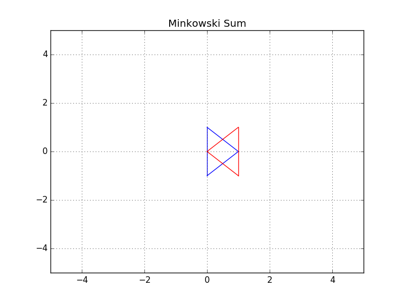

# Path planing and navigation

## Table of contents
* [Path planning](#path-planning)
  * [Discrete planning](#discrete-planning)
  * [Sample-Based planning](#sample-based-planning)
  * [Probabilistic path planning](#probabilistic-path-planning)
* [Continuous representation](#Continuous-representation)
* [Minkowski Sum](#minkowski-sum)
  * [Quiz: Minkowski Sum](#quiz-minkowski-sum)
  * [Programming quiz: Minkowski Sum](#programming-quiz-minkowski-sum)
* [Translation and Rotation](#translation-and-rotation)
* [3D Configuration Space](#3d-configuration-space)
  * [Quiz: 3D Configuration Space](#quiz-3d-configuration-space)
* [Discretization](#discretization)
  * [Roadmap](#roadmap)
    * [Visibility graph](#visibility-graph)
    * [Voronoi Diagram](#voronoi-diagram)
  * [Cell Decomposition](#cell-decomposition)
    * [Exact cell decomposition](#exact-cell-decomposition)
    * [Approximate cell decomposition](#approximate-cell-decomposition)
  * [Gradient Field (Potential Field)](#gradient-field-potential-field)
* [Graph search](#graph-search)
  * [Uniformed](#uniformed)
    * [Breadth-First search](#bread-first-search)
    * [Depth-First search](#depth-first-search)
    * [Uniform Cost search](#uniform-cost-search)
  * [Informed](#informed)
    * [A* Search](#a-*-serach)
  * [Terminology](#terminology)
* [Overall concerns regarding search](#overall-concerns-regarding-search)
  * [Bidirectional Search](#bidirectional-search)
  * [Path proximity to obstacles](#path-proximity-to-obstacles)
  * [Paths aligned to grid](#path-aligned-to-grid)

### Path planning
It is a strategic solution to the problem of "How do I get there?".

It takes in as inputs the provided environment geometry, the robots geometry, and the robots start and goal poses and uses this information to produce a path from start to goal.

Obstacle avoidance is a series of tactical decisions the robot must make as it moves along its path.

#### Discrete planning
Discrete planning looks to explicitly discretize the robot's workspace into a connected graph, and apply a graph-search algorithm to calculate the best path. This procedure is very precise (in fact, the precision can be adjusted explicitly by changing how fine you choose to discretize the space) and very thorough, as it discretizes the _complete_ workspace. As a result, discrete planning can be very computationally expensive - possibly prohibitively so for large path planning problems.

The image below displays one possible implementation of discrete path planning applied to a 2-dimensional workspace.


Discrete path planning is elegant in its preciseness, but is best suited for low-dimensional problems. For high-dimensional problems, sample-based path planning is a more appropriate approach.

It can be broken down into three distinct steps. The first step is to develop a convenient continuous representation by representing the problem space as the configuration space also known as a C Space. It is a set of all robot poses and an alternate way of representing the problem space. It takes into account the geometry of the robot and makes it easier to apply discrete search algorithms. The C space is divided into C Free and C Obstacles. Next, the configuration space must be discretized into a representation that is more easily manipulated by algorithms. The discretized space is represented by a graph. Finally, a search algorithm can be applied to the graph to find the best path from the start node to the goal node.

We will broke it down into three steps:
1. Continuous representation

    How to create a configuration space.

2. Discretization

    Three different types of methods that can be used to represent a configuration space with discrete segments.

3. Graph search

    How to traverse the graph to find the best path for your robot.

#### Sample-Based planning
Sample-based path planning probes the workspace to incrementally construct a graph. Instead of discretizing _every_ segment of the workspace, sample-based planning takes a number of samples and uses them to build a discrete representation of the workspace. The resultant graph is not as precise as one created using discrete planning, but it is much quicker to construct because of the relatively small number of samples used.

A path generated using sample-based planning may not be the best path, but in certain applications - it's better to generate a feasible path quickly than to wait hours or even days to generate the optimal path.

The image below displays a graph representation of a 2-dimensional workspace created using sample-based planning.


#### Probabilistic path planning
The last type of path planning that you will learn about in this module is probabilistic path planning. While the first two approaches looked at the path planning problem generically - with no understanding of who or what may be executing the actions - probabilistic path planning takes into account the uncertainty of the robot's motion.

While this may not provide significant benefits in some environments, it is especially helpful in highly-constrained environment or environments with sensitive or high-risk areas.

The image below displays probabilistic path planning applied to an environment containing a hazard (the lake at the top right).


### Continuous representation
To account for the geometry of a robot and simplify the task of path planning, obstacles in the workspace can be inflated to create a new space called the configuration space (or C-space). With the obstacles inflated by the radius of the robot, the robot can then be treated as a point, making it easier for an algorithm to search for a path. The C-space is the set of _all_ robot poses, and can be broken-down into C<sub>Free</sub> and C<sub>Obs</sub>.

### Minkowski Sum
The Minkowski sum is a mathematical property that can be used to compute the configuration space given an obstacle geometry and robot geometry.

The intuition behind how the Minkowski sum is calculated can be understood by imagining to paint the outside of an obstacle using a paintbrush that is shaped like your robot, with the robot's origin as the tip of the paintbrush. The painted area is C<sub>Obs</sub>. The image below shows just this.


To create the configuration space, the Minkowski sum is calculated in such a way for every obstacle in the workspace. The image below shows three configuration spaces created from a single workspace with three different sized robots. As you can see, if the robot is just a dot, then the obstacles in the workspace are only inflated by a small amount to create the C-space. As the size of the robot increases, the obstacles are inflated more and more.


For convex polygons, computing the convolution is trivial and can be done in linear time - however for non-convex polygons (i.e. ones with gaps or holes present), the computation is much more expensive.

#### Quiz: Minkowski Sum


Which of the following images represents the Configuration Space for the robot (purple) and obstacle (white) presented above?


Which of the images is the correct configuration space for the obstacle and robot described above? **B**

#### Programming quiz: Minkowski Sum


n this example, you can see two triangles - a blue and a red one. Let's suppose the robot is represented by a blue triangle and the obstacle is represented by a red triangle. Your task is to compute the configuration space **C** of robot **A** and obstacle **B** in C++.

**Robot**: Blue triangle denoted by A
**Obstacle**: Red triangle denoted by B

```cpp
// Compute the Minkowski Sum of two vectors
vector<vector<int> > minkowski_sum(vector<vector<int> > A, vector<vector<int> > B)
{
  vector<vector<int> > C;
  for (int i = 0; i < A.size(); i++)
  {
    for (int j = 0; j < B.size(); j++)
    {
      // Compute the current sum
      vector<int> Ci = { A[i][0] + B[j][0], A[i][1] + B[j][1] };
      // Push it to the C vector
      C.push_back(Ci);
    }
  }
  C = delete_duplicate(C);
  return C;
}

// Check for duplicate coordinates inside a 2D vector and delete them
vector<vector<int> > delete_duplicate(vector<vector<int> > C)
{
  // Sort the C vector
  sort(C.begin(), C.end());
  // Initialize a non duplicated vector
  vector<vector<int> > Cn;
  for (int i = 0; i < C.size() - 1; i++)
  {
    // Check if it's a duplicate coordinate
    if (C[i] != C[i + 1])
    {
      Cn.push_back(C[i]);
    }
  }
  Cn.push_back(C[C.size() - 1]);
  return Cn;
}

int main()
{
  // Define the coordinates of triangle A and B using 2D vectors
  vector<vector<int> > A(3, vector<int>(2));
  A = {{ 1, 0 }, { 0, 1 }, { 0, -1 },};
  vector<vector<int> > B(3, vector<int>(2));
  B = {{ 0, 0 }, { 1, 1 }, { 1, -1 },};

  // Compute the minkowski sum of triangle A and B
  vector<vector<int> > C;
  C = minkowski_sum(A, B);

  // Print the resulting vector
  print2DVector(C);

  return 0;
}
```

**Generated Configuration Space**


**Translation**

You successfully coded the Minkowski sum in C++ and generated the configuration space. You can easily notice that the red obstacle is not well inflated and the blue robot can still hit the obstacle. That's because the configuration space still has to be shifted to the obstacle.

Initially, the robot should be translated to the obstacle, and then after computing the configuration space, it should be translated to both the robot and obstacle.

**Final Result**

You successfully coded the Minkowski sum in C++ and generated the configuration space. You can easily notice that the red obstacle is not well inflated and the blue robot can still hit the obstacle. That's because the configuration space still has to be shifted to the obstacle.

Initially, the robot should be translated to the obstacle, and then after computing the configuration space, it should be translated to both the robot and obstacle.


Above is the resulting image where both the blue robot and the green configuration space have been shifted. You can now see the yellow padding which represents the translated configurations space all around the red obstacle. The blue robot will never be able to hit the red obstacle since it's well inflated.

**Plotting**

1. Computed the centroid of each polygon
2. Computed the angle of each point-centroid with respect to the x-axis
3. Sorted the points in ascending order of their angles (clockwise)
4. Plotted a line between each consecutive point

### Translation and Rotation
What would happen if we were to rotate our robot by, say, 38 degrees?

The configuration space changes depending on the orientation of the robot. One way to standarize the configuration space for an odd shape robot would be to enclose the robot in a bounding circle.

The circle represents the worst-case scenario. For some orientations of the robot, it is a relatively accurate representation of the bounds of its vertices. But for others, it may be significant exaggeration. However, at all times, the bounding circle is equal to or larger than the robot and is current configuration. So, if a path is found for the bounding circle, it will work for the robot.

This method is simple, but it comes with a significant drawback. An algorithm applied to this generalization would not be complete.

When you add the ability for the robot to rotate, you are adding a degree of freedom. The appropriate way to represent this in the configuration space is to add a dimension. The x-y plane would continue to represent the translation of the robot in the workspace, while the vertical axis would represent rotation of the robot.

### 3D Configuration Space
The configuration space for a robot changes depending on its rotation. Allowing a robot to rotate adds a degree of freedom - so, sensibly, it complicates the configuration space as well. Luckily, this is actually very simple to handle. The dimension of the configuration space is equal to the number of degrees of freedom that the robot has.

While a 2D configuration space was able to represent the x- and y-translation of the robot, a third dimension is required to represent the rotation of the robot.

Let's look at a robot and its corresponding configuration space for two different rotations. The first will have the robot at 0°, and the second at 18°.


A three-dimensional configuration space can be generated by stacking two-dimensional configuration spaces as layers - as seen in the image below:


If we were to calculate the configuration spaces for infinitesimally small rotations of the robot, and stack them on top of each other - we would get something that looks like the image below:


The image above displays the configuration space for a triangular robot that is able to translate in two dimensions as well as rotate about its z-axis. While this image looks complicated to construct, there are a few tricks that can be used to generate 3D configuration spaces and move about them. The following video from the Freie Universität Berlin is a wonderful visualization of a 3D configuration space. The video will display different types of motion, and describe how certain robot motions map into the 3D configuration space.

#### Quiz: 3D Configuration Space
When a robot rotates about one of it's boundary points (edges or vertices), how is this motion represented in the 3D configuration space? **Helix**

### Discretization
To be able to apply a search algorithm, the configuration space must be reduced to a finite size that an algorithm can traverse in a reasonable amount of time, as a searches for a path from the start to the goal. This reduction in size can be accomplished by discretiztion.

Discretization is the process of breaking down a continuous entity, in this case a configuration space into discrete segments. There are different methods that can be applied to discretize a continuous space.

#### Roadmap
The first group of discretization approaches that you will learn is referred to by the name Roadmap. These methods represent the configuration space using a simple connected graph - similar to how a city can be represented by a metro map.


Roadmap methods are typically implemented in two phases:
* The **construction phase** builds up a graph from a continuous representation of the space. This phase usually takes a significant amount of time and effort, but the resultant graph can be used for multiple queries with minimal modifications.
* The **query phase** evaluates the graph to find a path from a start location to a goal location. This is done with the help of a search algorithm.

In this Discretization section, we will only discuss and evaluate the construction phase of each Roadmap method. Whereas the query phase will be discussed in more detail in the Graph Search section, following Discretization.

##### Visibility graph
he Visibility Graph builds a roadmap by connecting the start node, all of the obstacles' vertices, and goal node to each other - except those that would result in collisions with obstacles. The Visibility Graph has its name for a reason - it connects every node to all other nodes that are 'visible' from its location.

> Nodes: Start, Goal, and all obstacle vertices.

> Edges: An edge between two nodes that does not intersect an obstacle, including obstacle edges.

The following image illustrates a visibility graph for a configuration space containing polygonal obstacles.


The motivation for building Visibility Graphs is that the shortest path from the start node to the goal node will be a piecewise linear path that bends only at the obstacles' vertices. This makes sense intuitively - the path would want to hug the obstacles' corners as tightly as possible, as not to add any additional length.

Once the Visibility Graph is built, a search algorithm can be applied to find the shortest path from Start to Goal. The image below displays the shortest path in this visibility graph.


**Quiz**

Although the algorithms used to search the roadmap have not yet been introduced - it is still worth analysing whether any algorithm would be able to find a path from start to goal, and whether the optimal path lies within the roadmap.

Is the visibility graph complete? Does it contain the optimal path? **Complete and Optimal**

Having completed the quiz, you should have by now seen the advantages of the Visibility Graph method. One disadvantage to the Visibility Graph is that it leaves no clearance for error. A robot traversing the optimal path would have to pass incredibly close to obstacles, increasing the risk of collision significantly. In certain applications, such as animation or path planning for video games, this is acceptable. However the uncertainty of real-world robot localization makes this method impractical.

##### Voronoi Diagram
Another discretization method that generates a roadmap is called the Voronoi Diagram. Unlike the visibility graph method which generates the shortest paths, Voronoi Diagrams maximize clearance between obstacles.

A Voronoi Diagram is a graph whose edges bisect the free space in between obstacles. Every edge lies equidistant from each obstacle around it - with the greatest amount of clearance possible. You can see a Voronoi Diagram for our configuration space in the graphic below:


Once a Voronoi Diagram is constructed for a workspace, it can be used for multiple queries. Start and goal nodes can be connected into the graph by constructing the paths from the nodes to the edge closest to each of them.

Every edge will either be a straight line, if it lies between the edges of two obstacles, or it will be a quadratic, if it passes by the vertex of an obstacle.

**Quiz**

Once again, it is worth investigating - will the roadmap built by the voronoi diagram contain a path from start to goal, and will it contain the optimal path.

Is the Voronoi Diagram complete? Does it contain the optimal path? **Complete**

It contains a path from start to goal with the most possible clearance, which in certain applications is more desirable than the optimal path.

#### Cell Decomposition
Another discretization method that can be used to convert a configuration space into a representation that can easily be explored by a search algorithm is cell decomposition. Cell decomposition divides the space into discrete cells, where each cell is a node and adjacent cells are connected with edges.

##### Exact cell decomposition
Exact cell decomposition divides the space into non-overlapping cells. This is commonly done by breaking up the space into triangles and trapezoids, which can be accomplished by adding vertical line segments at every obstacle's vertex. You can see the result of exact cell decomposition of a configuration space in the image below:


Once a space has been decomposed, the resultant graph can be used to search for the shortest path from start to goal. The resultant graph can be seen in the image below:


Exact cell decomposition is elegant because of its precision and completeness. Every cell is either 'full', meaning it is completely occupied by an obstacle, or it is 'empty', meaning it is free. And the union of all cells exactly represents the configuration space. If a path exists from start to goal, the resultant graph _will_ contain it.

To implement exact cell decomposition, the algorithm must order all obstacle vertices along the x-axis, and then for every vertex determine whether a new cell must be created or whether two cells should be merged together. Such an algorithm is called the Plane Sweep algorithm.

Exact cell decomposition results in cells of awkward shapes. Collections of uniquely-shaped trapezoids and triangles are more difficult to work with than a regular rectangular grid. This results in an added computational complexity, especially for environments with greater numbers of dimensions. It is also difficult to compute the decomposition when obstacles are not polygonal, but of an irregular shape.

For this reason, there is an alternate type of cell decomposition, that is much more practical in its implementation.

##### Approximate cell decomposition
Approximate cell decomposition divides a configuration space into discrete cells of simple, regular shapes - such as rectangles and squares (or their multidimensional equivalents). Aside from simplifying the computation of the cells, this method also supports hierarchical decomposition of space.

**Simple decomposition**

A 2-dimensional configuration space can be decomposed into a grid of rectangular cells. Then, each cell could be marked full or empty, as before. A search algorithm can then look for a sequence of free cells to connect the start node to the goal node.

Such a method is more efficient than exact cell decomposition, but it loses its completeness. It is possible that a particular configuration space contains a feasible path, but the resolution of the cells results in some of the cells encompassing the path to be marked 'full' due to the presence of obstacles. A cell will be marked 'full' whether 99% of the space is occupied by an obstacle or a mere 1%. Evidently, this is not practical.

**Iterative decomposition**

An alternate method of partitioning a space into simple cells exists. Instead of immediately decomposing the space into _small_ cells of equal size, the method _recursively_ decomposes a space into four quadrants. Each quadrant is marked full, empty, or a new label called 'mixed' - used to represent cells that are somewhat occupied by an obstacle, but also contain some free space. If a sequence of free cells cannot be found from start to goal, then the mixed cells will be further decomposed into another four quadrants. Through this process, more free cells will emerge, eventually revealing a path if one exists.

The 2-dimensional implementation of this method is called quadtree decomposition. It can be seen in the graphic below:


**Algorithm**

The algorithm behind approximate cell decomposition is much simpler than the exact cell decomposition algorithm. The pseudocode for the algorithm is provided below:

```
Decompose the configuration space into four cells, label cells free, mixed, or full.

Search for a sequence of free cells that connect the start node to the goal node.

If such a sequence exists:
  quadReturn path
Else:
  qquadFurther decompose the mixed cells
```


The three dimensional equivalent of quadtrees are octrees, depicted in the image below. The method of discretizing a space with any number of dimensions follows the same procedure as the algorithm described above, but expanded to accommodate the additional dimensions.


Although exact cell decomposition is a more elegant method, it is much more computationally expensive than approximate cell decomposition for non-trivial environments. For this reason, approximate cell decomposition is commonly used in practice.

With enough computation, approximate cell decomposition approaches completeness. However, it is not optimal - the resultant path depends on how cells are decomposed. Approximate cell decomposition finds the obvious solution quickly. It is possible that the optimal path squeezes through a minuscule opening between obstacles, but the resultant path takes a much longer route through wide open spaces - one that the recursively-decomposing algorithms would find first.

Approximate cell decomposition is functional, but like all discrete/combinatorial path planning methods - it starts to be computationally intractable for use with high-dimensional environments.

**Quiz**

Which of the following statements are true about cell decomposition?
* In practice, approximate cell decomposition is preferred due to its more manageable computation.
* Approximate cell decomposition is not optimal because obvious (wide/open) paths are found first.
* The quadtree and octree methods recursively decompose mixed cells until they find a sequence of free cells form start to goal.

#### Gradient Field (Potential Field)
The potential field method performs a different type of discretization.

To accomplish its task, the potential field method generates two functions - one that attracts the robot to the goal and one that repels the robot away from obstacles. The two functions can be summed to create a discretized representation. By applying an optimization algorithm such as gradient descent, a robot can move toward the goal configuration while steering around obstacles. Let's look at how each of these steps is implemented in more detail.

**Attractive Potential Field**

The attractive potential field is a function with the global minimum at the goal configuration. If a robot is placed at any point and required to follow the direction of steepest descent, it will end up at the goal configuration. This function does not need to be complicated, a simple quadratic function can achieve all of the requirements discussed above.


Where **x** represents the robot's current position, and **x**<sub>goal</sub> the goal position. _ν_ is a scaling factor.

A fragment of the attractive potential field is displayed in the image below:


**Repulsive Potential Field**

The repulsive potential field is a function that is equal to zero in free space, and grows to a large value near obstacles. One way to create such a potential field is with the function below:


Where the function ρ(**x**) returns the distance from the robot to its nearest obstacle, ρ<sub>0</sub> is a scaling parameter that defines the reach of an obstacle's repulsiveness, and _ν_ is a scaling parameter.

An image of a repulsive potential field for an arbitrary configuration space is provided below:


The value ρ<sub>0</sub> controls how far from an obstacle the potential field will be non-zero, and how steep the area surrounding an obstacle will be.

Past ρ<sub>0</sub>, the potential field is zero. Within a ρ<sub>0</sub> distance of the obstacle, the potential field scales with proximity to the obstacle.

**Potential Field Sum**

The attractive and repulsive functions are summed to produce the potential field that is used to guide the robot from anywhere in the space to the goal. The image below shows the summation of the functions, and the image immediately after displays the final function.


Imagine placing a marble onto the surface of the function - from anywhere in the field it will roll in the direction of the goal without colliding with any of the obstacles (as long as ρ<sub>0</sub> is set appropriately)!

The gradient of the function dictates which direction the robot should move, and the speed can be set to be constant or scaled in relation to the distance between the robot and the goal.

**Problems with the Potential Field Method**

The potential field method is not without its faults - the method is neither complete nor optimal. In certain environments, the method will lead the robot to a **local minimum**, as opposed to the global minimum. The images below depict one such instance. Depending on where the robot commences, it may be led to the bottom of the smile.

The image below depicts the configuration space, and the following image displays the corresponding potential field:


The problem of a robot becoming stuck in a local minimum can be resolved by adding random walks, and other strategies that are commonly applied to gradient descent, but ultimately the method is not complete.

The potential field method isn't optimal either, as it may not always find the shortest (or cheapest) path from start to goal. The shortest path may not follow the path of steepest descent. In addition, potential field does not take into consideration the cost of every step.

### Graph search
It is used to find a finite sequence of discrete actions to connect a start state to a goal state. It does so by searching. Visiting states sequentially asking every state, "Hey, are you the goal state?"

#### Uninformed
Uniformed search algorithms are not provided with any information about the whereabouts of the goal, and thus search blindly. The only difference between different uninformed algorithms is the order in which they expand nodes.

##### Breadth-First search
Bread-First search (BFS) searches a space broadly before it searches deeply.


**Quiz**

On which steps of its search would the BFS algorithm reach the nodes labelled A, B, and C?
* A: 23
* B: 27
* C: 22

Is the breadth-first search algorithm complete? Optimal? Efficient? **Complete and Optimal**

You're right! BFS is complete because it will always find _a_ solution, and it is optimal because it will always find the shortest solution (since it explores the shortest routes first), but it might take the algorithm a loooong time to find the solution. So the algorithm is not efficient!

##### Depth-First search
Depth-First search (DFS) is an uninformed search algorithm. It searches deep before it searches broadly. DFS will explore the start nodes first child and then that nodes first child and so on until it hits the lowest leaf in this branch. Only ten will DFS backup to a node which had more than one child and explore this node second child.


**Quiz**

On which steps of its search would the DFS algorithm reach the nodes labeled A, B, and C?
* A: 20
* B: 18
* C: 32

Is the depth-first search algorithm complete? Optimal? Efficient? **DFS is neither complete, nor optimal, nor efficient.**

##### Uniform Cost search
It builds upon BFS to be able to search graphs with differing edge costs. It is also optimal because it expands nodes in order of increasing path cost. Path cost refers to the sum of all edge costs leading from the start to that node.


**Quiz**

If you are to expand the search to include all nodes with a path cost of 5, which of the following nodes will not be explored? **B, D and F**

Is uniform cost search algorithm complete? Optimal? Efficient? **Uniform Cost Search is complete if every step cost is greater than some value, ϵ (otherwise, it can get stuck in infinite loops). And it's also optimal!**

#### Informed
Informed searches, on the other hand, are provided with information pertaining to the location of the goal. As a result, these search algorithms are able to evaluate some nodes to be more promising than others. This makes their search more efficient.

##### A* Search
A* Search is an informed search. It takes into account information about the goal's location as it goes about its search. It does so, by using a heuristic function and a path cost

h(n) = heuristic function estimates distance from a node to goal
g(n) = path cost

A* chooses: f(n) = g(n) + f(n)

A* search orders the frontier using a priority queue, ordered by f(n), the sum of the path cost and the heuristic function. This is very effective, as it requires the search to keep paths short, while moving towards the goal. However, as you may have discovered in the quiz - A* search is not guaranteed to be optimal. Let's look at why this is so!

A* search will find the optimal path if the following conditions are met,

* Every edge must have a cost greater than some value, ϵ, otherwise, the search can get stuck in infinite loops and the search would not be complete.
* The heuristic function must be consistent. This means that it must obey the triangle inequality theorem. That is, for three neighbouring points (x<sub>1</sub>, x<sub>2</sub>, x<sub>3</sub>), the heuristic value for x<sub>1</sub> to x<sub>3</sub> must be less than the sum of the heuristic values for x<sub>1</sub> to x<sub>2</sub> and to x<sub>3</sub>.
* The heuristic function must be admissible. This means that h(n) must always be less than or equal to the true cost of reaching the goal from every node. In other words, h(n) must never overestimate the true path cost.

To understand where the admissibility clause comes from, take a look at the image below. Suppose you have two paths to a goal where one is optimal (the highlighted path), and one is not (the lower path). Both heuristics overestimate the path cost. From the start, you have four nodes on the frontier, but Node N would be expanded first because its h(n) is the lowest - it is equal to 62. From there, the goal node is added to the frontier - with a cost of 23 + 37 = 60. This node looks more promising than Node P, whose h(n) is equal to 63. In such a case, A* finds a path to the goal which is not optimal. If the heuristics never overestimated the true cost, this situation would not occur because Node P would look more promising than Node N and be explored first.


As you saw in the image above, admissibility is a requirement for A* to be optimal. For this reason, common heuristics include the Euclidean distance from a node to the goal, or in some applications the Manhattan distance. When comparing two different types of values - for instance, if the path cost is measured in hours, but the heuristic function is estimating distance - then you would need to determine a scaling parameter to be able to sum the two in a useful manner.

While A* is a much more efficient search in most situations, there will be environments where it will not outperform other search algorithms. This happens if the path to the goal happens to go in the opposite direction first.

Variants of A* search exist - some accommodate the use of A* search in dynamic environments, while others help A* become more manageable in large environments.

**Quiz**

Which of the following statements are correct about A* search?
* A heuristic function provides the robot with knowledge about the environment, guiding it in the direction of the goal.
* A* uses the sum of the path cost and the heuristic function to determine which nodes to explore next.
* A* uses a priority queue as the data structure underlying the frontier.
* Choosing an appropriate heuristic function (ex. Euclidean distance, Manhattan distance, etc.) is important. The order in which nodes are explored will change from one heuristic to another.

#### Terminology
The **time complexity** of an algorithm assesses how long it takes an algorithm to generate a path, usually with respect to the number of nodes or dimensions present. It can also refer to the trade-off between quality of an algorithm (ex. completeness) vs its computation time.

The **space complexity** of an algorithm assesses how much memory is required to execute the search. Some algorithms must keep significant amounts of information in memory throughout their run-time, while others can get away with very little.

The **generality** of an algorithm considers the type of problems that the algorithm can solve - is it limited to very specific types of problems, or will the algorithm perform well in a broad range of problems?

### Overall concerns regarding search
#### Bidirectional Search
One way to improve a search's efficiency is to conduct two searches simultaneously - one rooted at the start node, and another at the goal node. Once the two searches meet, a path exists between the start node and the goal node.

The advantage with this approach is that the number of nodes that need to be expanded as part of the search is decreased. As you can see in the image below, the volume swept out by a unidirectional search is noticeably greater than the volume swept out by a bidirectional search for the same problem.


#### Path proximity to obstacles
Another concern with the search of discretized spaces includes the proximity of the final path to obstacles or other hazards. When discretizing a space with methods such as cell decomposition, empty cells are not differentiated from one another. The optimal path will often lead the robot very close to obstacles. In certain scenarios this can be quite problematic, as it will increase the chance of collisions due to the uncertainty of robot localization. The optimal path may not be the best path. To avoid this, a map can be 'smoothed' prior to applying a search to it, marking cells near obstacles with a higher cost than free cells. Then the path found by A* search may pass by obstacles with some additional clearance.

#### Paths aligned to grid
Another concern with discretized spaces is that the resultant path will follow the discrete cells. When a robot goes to execute the path in the real world, it may seem funny to see a robot zig-zag its way across a room instead of driving down the room's diagonal. In such a scenario, a path that is optimal in the discretized space may be suboptimal in the real world. Some careful path smoothing, with attention paid to the location of obstacles, can fix this problem.
